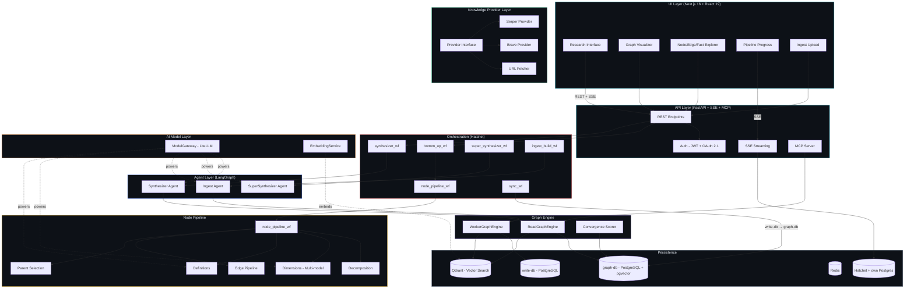
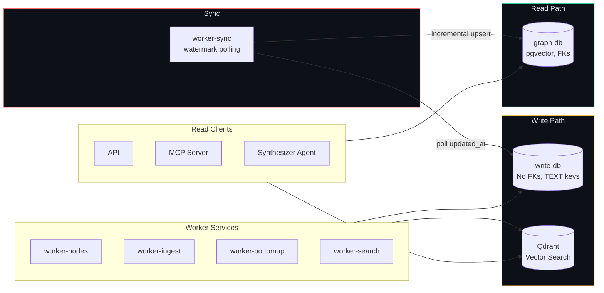
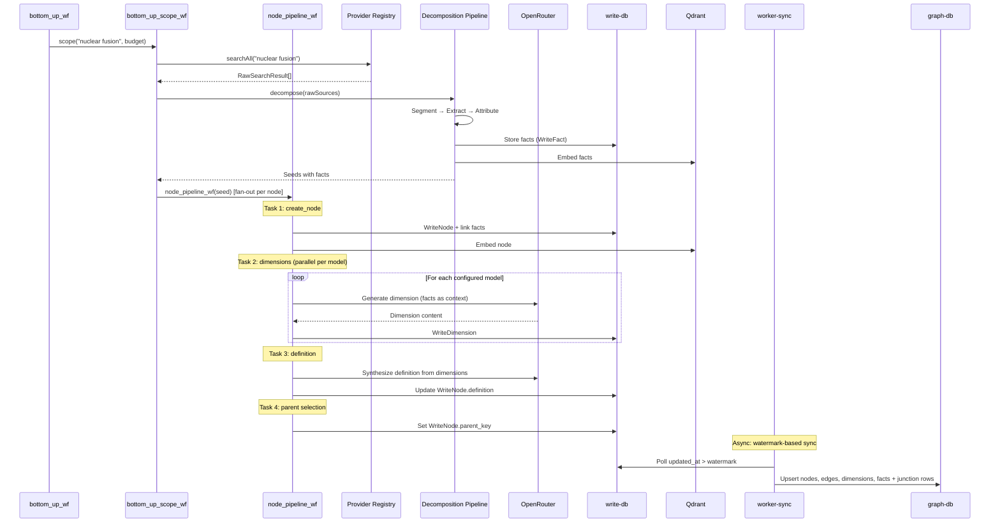
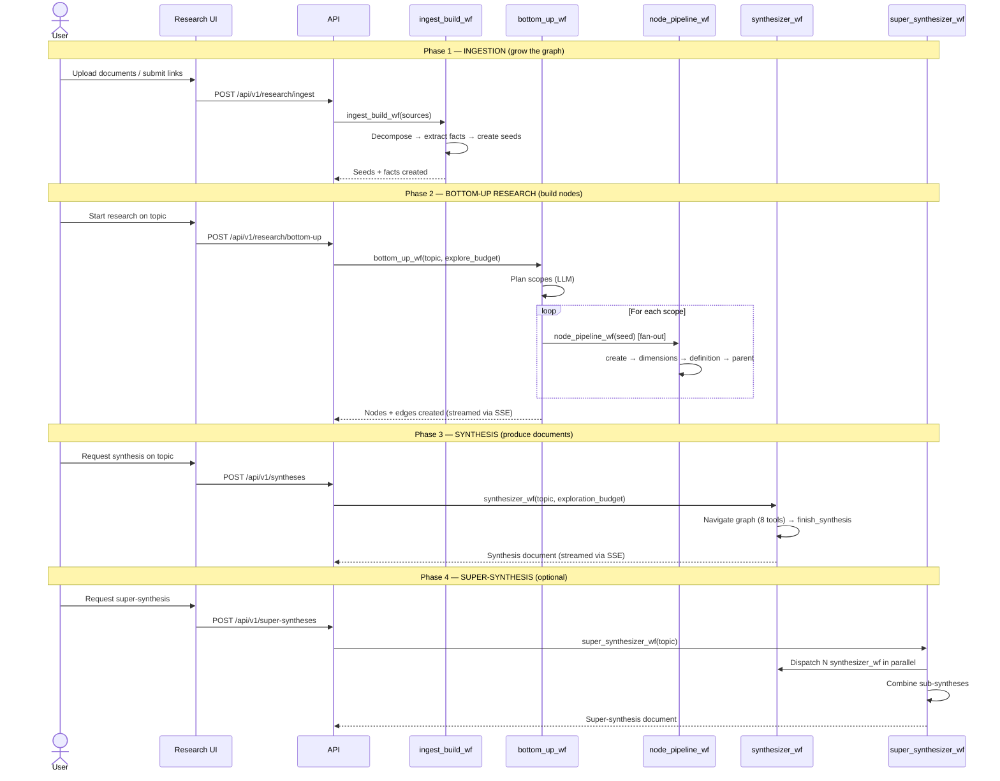
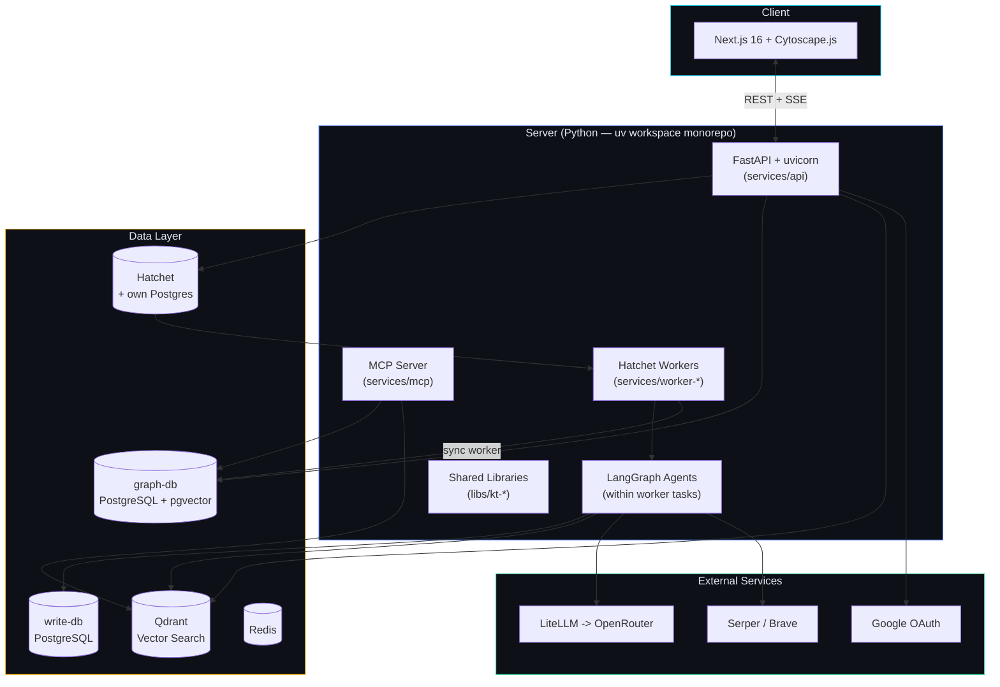

# Knowledge Tree — Requirements & Architecture Specification v1.0

## Table of Contents

1. [Product Vision](#1-product-vision)
2. [System Requirements](#2-system-requirements)
3. [Architecture Overview](#3-architecture-overview)
4. [Data Model](#4-data-model)
5. [Agent Architecture](#5-agent-architecture)
6. [Knowledge Provider Layer](#6-knowledge-provider-layer)
7. [Fact Decomposition Pipeline](#7-fact-decomposition-pipeline)
8. [Graph Engine](#8-graph-engine)
9. [Research & Synthesis Flow](#9-research--synthesis-flow)
10. [Convergence](#10-convergence)
11. [Multimodel Dimensional Analysis](#11-multimodel-dimensional-analysis)
12. [API Design](#12-api-design)
13. [UI Requirements](#13-ui-requirements)
14. [Technology Stack](#14-technology-stack)
15. [Implementation Phases](#15-implementation-phases)

---

## 1. Product Vision

A knowledge integration system that builds understanding exclusively from raw external data — never from model internal knowledge. The system constructs and evolves a knowledge graph where every node is grounded in provenance-tracked facts decomposed from real sources.

**Core value proposition:** Over time, frequently queried topics accumulate increasingly rich factual bases. The multi-model, multi-source approach bypasses systemic biases inherent in any single model or source, enabling genuine discovery of patterns that no single perspective would reveal.

**Key design drivers (priority order):**

1. **Knowledge from data, not from models.** Models are reasoning engines, not knowledge sources. All knowledge must trace back to external raw data.
2. **Integration, not ignoring.** The system never discards coherent information. Contradictory facts coexist within nodes, surfaced transparently rather than suppressed.
3. **Extensibility.** Clean interfaces allow new knowledge providers (search engines, databases, APIs), new AI models, and new decomposition strategies without architectural changes.
4. **Accumulation.** The graph improves with every query. Nodes visited frequently become deeply supported. Budget=0 queries leverage all prior work.
5. **Transparency.** Users see the graph, the nodes, the facts, the sources, the convergence scores, and the divergences. Nothing is hidden.

---

## 2. System Requirements

### 2.1 Functional Requirements

#### FR-1: Knowledge Graph Management
- **FR-1.1:** The system SHALL maintain a persistent knowledge graph where nodes represent concepts, entities, events, locations, syntheses, or supersyntheses. Nodes have a `node_type` field: `concept` (abstract topics), `entity` (subjects capable of intent — person, organization), `event` (temporal occurrences), `location` (geographic places), `synthesis` (composite document synthesizing multiple source nodes), or `supersynthesis` (meta-synthesis combining multiple synthesis nodes).
- **FR-1.2:** Nodes SHALL be linked to other nodes via typed, weighted edges. The graph is flat — all nodes are peers. Circular references are valid and expected.
- **FR-1.3:** Edges SHALL only be created from shared factual evidence (seed co-occurrence candidates) — semantic proximity alone does NOT create edges. Embedding similarity is a search tool, not a structural mechanism.
- **FR-1.4:** Nodes SHALL reference facts, and facts SHALL reference their original raw sources with stored links.
- **FR-1.5:** Node content size SHALL be configurable (default: 500 tokens per dimension).
- **FR-1.7:** The system SHALL support node merging when independently created nodes describe the same concept.

#### FR-2: Query & Budget System
- **FR-2.1:** Users SHALL submit queries with a configurable exploration budget (measured in node operations).
- **FR-2.2:** Budget=0 queries SHALL use only existing nodes — no new nodes created, no existing nodes expanded.
- **FR-2.3:** Positive-budget queries SHALL create new nodes or expand existing nodes until budget is exhausted.
- **FR-2.4:** When no new nodes are needed, remaining budget SHALL be used to expand existing nodes with additional data from providers.
- **FR-2.5:** The system SHALL provide a synthesized answer drawn from the navigated graph.
- **FR-2.6:** The system SHALL expose the full subgraph used to generate each answer for user exploration.

#### FR-3: Fact Decomposition
- **FR-3.1:** Raw data from providers SHALL be decomposed by the decomposition pipeline into typed elements: claims, accounts, measurements, formulas, quotes, procedures, references, code, images, and perspectives.
- **FR-3.2:** Decomposition SHALL be objective — elements are recorded as reported in the source without judgment.
- **FR-3.3:** Each decomposed fact SHALL retain its source attribution (who said it, where, when, in what context).
- **FR-3.4:** Raw source data SHALL be stored for potential reprocessing.
- **FR-3.5:** Facts SHALL be stored persistently and grow over time, forming the system's factual base.

#### FR-4: Knowledge Providers
- **FR-4.1:** The system SHALL use the Brave Search API as the initial knowledge provider.
- **FR-4.2:** The provider interface SHALL be abstract, supporting addition of new providers (other search engines, document stores, custom APIs) without modifying core logic.
- **FR-4.3:** Raw data from all providers SHALL flow into the same fact decomposition pipeline.

#### FR-5: Multimodel Analysis
- **FR-5.1:** Each node SHALL contain dimensions — one per configured AI model.
- **FR-5.2:** Dimensions SHALL be generated independently by each model using the same fact base.
- **FR-5.3:** A convergence report SHALL be auto-generated for each node comparing all dimensions.
- **FR-5.4:** Models SHALL serve as reasoning engines over facts, not as knowledge sources.

#### FR-6: Research & Synthesis Agents
- **FR-6.1:** The system SHALL support document-based research through specialized agents: a synthesizer agent that navigates the graph to produce synthesis documents, and an ingest agent that builds nodes from uploaded sources.
- **FR-6.2:** The synthesizer agent SHALL navigate the knowledge graph using an exploration budget (number of nodes it can visit) and produce a standalone research document grounded in graph evidence.
- **FR-6.3:** A super-synthesizer agent SHALL combine multiple synthesis documents into a comprehensive meta-synthesis.
- **FR-6.4:** Fact gathering (via ingestion/bottom-up workflows) SHALL be separated from synthesis (document creation from existing graph). The graph grows through ingestion; synthesis reads from it.
- **FR-6.5:** The ingest agent SHALL build nodes from a pre-filled fact pool extracted from uploaded documents, links, and search results.
- **FR-6.6:** Bottom-up workflows SHALL orchestrate scope-based research: planning scopes, extracting facts, and promoting seeds to nodes.

#### FR-7: Source Tracking
- **FR-7.1:** All data added to nodes SHALL have stored links to their original sources.
- **FR-7.2:** Sources SHALL be viewable in the UI as clickable links.
- **FR-7.3:** The provenance chain from node → fact → raw source SHALL be fully traversable.

### 2.2 Non-Functional Requirements

#### NFR-1: Extensibility
- The system SHALL use interface-based design for all provider, model, and storage integrations.
- Adding a new knowledge provider SHALL require implementing a single interface, with no changes to existing code.
- Adding a new AI model SHALL require configuration only, no code changes.

#### NFR-2: Performance
- Budget=0 queries (graph-only, no expansion) SHALL respond within 3 seconds for graphs up to 10,000 nodes.
- Node creation operations SHALL be parallelizable where dependencies allow.
- The system SHALL support concurrent queries from multiple users.

#### NFR-3: Scalability
- The graph SHALL support growth to millions of nodes.
- Vector search SHALL maintain sub-second lookup at scale (via pgvector or equivalent).
- Fact storage SHALL support append-only growth to billions of records.

#### NFR-4: Auditability
- All filter configurations SHALL be versioned and reproducible.
- All AI model calls SHALL be logged with input/output for debugging.
- Every fact's provenance chain SHALL be inspectable.

#### NFR-5: Data Integrity
- Raw source data SHALL be append-only (never modified or deleted).
- Node history SHALL be preserved — updates create new versions, not overwrites.
- The convergence score computation SHALL be deterministic given the same inputs.

---

## 3. Architecture Overview



### Layered Architecture

The system follows a strict layered architecture with dependency inversion at every boundary:

| Layer | Responsibility | Depends On |
|-------|---------------|------------|
| **UI Layer** | Document-based research interface, graph visualization, entity browsing, file ingestion | API Layer (REST + SSE) |
| **API Layer** | FastAPI endpoints with JWT/OAuth auth, SSE streaming, MCP server (`services/api`, `services/mcp`) | Orchestration (Hatchet dispatch), ReadGraphEngine |
| **Orchestration Layer** | Hatchet durable workflows: bottom-up research, synthesis, super-synthesis, node pipeline, ingest, search, sync. Each workflow type runs in its own worker service (`services/worker-*`). | Agent Layer, Node Pipeline |
| **Agent Layer** | LangGraph agents within Hatchet tasks: synthesizer (`kt_worker_synthesis`), super-synthesizer (`kt_worker_synthesis`), ingest (`kt_worker_ingest`) | Graph Engine, Provider Layer, Model Layer |
| **Node Pipeline** | Hatchet DAG: create_node -> dimensions -> definition -> parent | Fact Store, Model Layer, Persistence |
| **Graph Engine** | Split into ReadGraphEngine (graph-db + Qdrant reads) and WorkerGraphEngine (write-db + Qdrant writes). Convergence scoring. | Fact Store, Persistence, Qdrant |
| **Fact Store** | Typed fact storage, indexing, deduplication, retrieval by concept | Persistence |
| **Provider Layer** | Raw data fetching from external sources (Serper, Brave, URL fetcher) | External APIs |
| **Ingestion Layer** | File/link upload, content extraction (PDF, DOCX, etc.), partitioning, decomposition | Fact Store, Persistence |
| **Auth Layer** | JWT + Google OAuth + OAuth 2.1 + API tokens via fastapi-users + kt-auth | Persistence |
| **Model Layer** | AI model routing with per-agent overrides and thinking levels | OpenRouter / External AI APIs |
| **Persistence** | Dual PostgreSQL (graph-db + write-db), Qdrant (vector search), Redis, Hatchet (workflow state) | Infrastructure |

---

## 4. Data Model

### 4.1 Entity Relationship Diagram (graph-db)

> **Note:** This ER diagram shows the **graph-db** (read-optimized) schema. The **write-db** has a parallel schema with `Write*` prefixed models (WriteNode, WriteEdge, WriteDimension, WriteFact, WriteSeed, WriteEdgeCandidate, etc.) — see `kt_db/write_models.py`. Write-db entities have TEXT primary keys and no foreign key constraints. The sync worker propagates write-db data into graph-db.

```mermaid
erDiagram
    NODE ||--o{ DIMENSION : "has dimensions"
    NODE ||--o| CONVERGENCE_REPORT : "has report"
    NODE ||--o{ NODE_FACT : "references"
    NODE ||--o{ EDGE : "connects via"
    NODE ||--o{ NODE_VERSION : "has versions"

    FACT ||--o{ NODE_FACT : "referenced by"
    FACT ||--o{ FACT_SOURCE : "sourced from"

    RAW_SOURCE ||--o{ FACT_SOURCE : "produces"
    RAW_SOURCE }o--|| PROVIDER_FETCH : "fetched in"

    DIMENSION }o--|| AI_MODEL : "generated by"

    CONVERGENCE_REPORT ||--o{ DIVERGENT_CLAIM : "contains"

    EDGE }o--|| QUERY_ORIGIN : "created during"

    NODE {
        uuid id PK
        string concept
        string node_type
        uuid parent_concept_id FK
        float[] embedding
        string attractor
        string filter_id
        int max_content_tokens
        timestamp created_at
        timestamp updated_at
        duration stale_after
        int update_count
        int access_count
    }

    EDGE {
        uuid id PK
        uuid source_node_id FK
        uuid target_node_id FK
        string relationship_type
        float weight
        uuid created_by_query FK
        timestamp created_at
        jsonb metadata
    }

    DIMENSION {
        uuid id PK
        uuid node_id FK
        string model_id
        text content
        float confidence
        string[] suggested_concepts
        float[] embedding
        timestamp generated_at
        jsonb model_metadata
    }

    CONVERGENCE_REPORT {
        uuid id PK
        uuid node_id FK
        float convergence_score
        string[] converged_claims
        text recommended_content
        timestamp computed_at
    }

    DIVERGENT_CLAIM {
        uuid id PK
        uuid report_id FK
        text claim
        jsonb model_positions
        string divergence_type
        text analysis
    }

    FACT {
        uuid id PK
        text content
        string fact_type
        float[] embedding
        jsonb metadata
        timestamp created_at
    }

    FACT_SOURCE {
        uuid id PK
        uuid fact_id FK
        uuid raw_source_id FK
        text context_snippet
        string attribution
    }

    RAW_SOURCE {
        uuid id PK
        string uri
        string title
        text raw_content
        string content_hash
        string provider_id
        timestamp retrieved_at
        jsonb provider_metadata
    }

    NODE_FACT {
        uuid node_id FK
        uuid fact_id FK
        float relevance_score
        string stance
        timestamp linked_at
    }

    NODE_VERSION {
        uuid id PK
        uuid node_id FK
        int version_number
        jsonb snapshot
        timestamp created_at
    }

    PROVIDER_FETCH {
        uuid id PK
        string provider_id
        string query
        timestamp fetched_at
        int result_count
        jsonb fetch_metadata
    }

    AI_MODEL {
        string model_id PK
        string provider
        string display_name
        string[] known_biases
        jsonb config
    }

    QUERY_ORIGIN {
        uuid id PK
        string query_text
        timestamp executed_at
    }

    CONVERSATION {
        uuid id PK
        string title
        string mode
        timestamp created_at
        timestamp updated_at
    }

    CONVERSATION_MESSAGE {
        uuid id PK
        uuid conversation_id FK
        int turn_number
        string role
        text content
        int nav_budget
        int explore_budget
        int nav_used
        int explore_used
        string status
        string workflow_run_id
        timestamp created_at
    }

    RESEARCH_REPORT {
        uuid id PK
        uuid message_id FK
        uuid conversation_id FK
        int nodes_created
        int edges_created
        int waves_completed
        int explore_budget
        int explore_used
        text[] scope_summaries
    }

    INGEST_SOURCE {
        uuid id PK
        uuid conversation_id FK
        string source_type
        string original_name
        string stored_path
        string status
        uuid raw_source_id FK
    }

    NODE_COUNTER {
        uuid node_id FK
        int access_count
        int update_count
    }

    USER {
        uuid id PK
        string email
        string display_name
        timestamp created_at
    }

    API_TOKEN {
        uuid id PK
        uuid user_id FK
        string name
        string token_hash
        boolean revoked
    }

    CONVERSATION ||--o{ CONVERSATION_MESSAGE : "has messages"
    CONVERSATION_MESSAGE ||--o| RESEARCH_REPORT : "has report"
    CONVERSATION ||--o{ INGEST_SOURCE : "has sources"
    NODE ||--o| NODE_COUNTER : "has counter"
    USER ||--o{ API_TOKEN : "has tokens"
    INGEST_SOURCE }o--o| RAW_SOURCE : "links to"
    EDGE ||--o{ EDGE_FACT : "evidenced by"
    FACT ||--o{ EDGE_FACT : "supports edge"
    DIMENSION ||--o{ DIMENSION_FACT : "grounded in"
    FACT ||--o{ DIMENSION_FACT : "supports dimension"

    EDGE_FACT {
        uuid edge_id FK
        uuid fact_id FK
        float relevance_score
    }

    DIMENSION_FACT {
        uuid dimension_id FK
        uuid fact_id FK
    }
```



### 4.2 Core Entities

#### Node
The atomic unit of the knowledge graph. All nodes are flat peers — structure comes from edges. Nodes are typed:

| Node Type | Category | Description | Example |
|-----------|----------|-------------|---------|
| `concept` | Base | Abstract topic, idea, technique, phenomenon, or subject | "moon", "photosynthesis", "pyramid construction techniques" |
| `entity` | Base | A subject capable of intent (person, organization) | "NASA" (organization), "Albert Einstein" (person) |
| `event` | Base | A temporal occurrence (historical, scientific, ongoing) | "Apollo 11 Moon Landing", "2024 Solar Eclipse" |
| `location` | Base | A geographic place (country, city, region, landmark) | "Tokyo", "Amazon Rainforest", "Mediterranean Sea" |
| `synthesis` | Composite | Composite document synthesizing multiple source nodes | A synthesis combining "solar power", "wind power", and "energy storage" |
| `supersynthesis` | Composite | Meta-synthesis combining multiple synthesis documents | A supersynthesis combining three synthesis documents on renewable energy |

**Base node types** (`concept`, `entity`, `event`, `location`) are built from raw facts. **Composite node types** (`synthesis`, `supersynthesis`) are built from other nodes and linked via `draws_from` edges.

```
Node:
  id:                 uuid                # primary key (deterministic via key_to_uuid)
  concept:            string              # human-readable concept label
  node_type:          string              # "concept" | "entity" | "event" | "location" | "synthesis" | "supersynthesis"
  parent_id:          uuid | null         # FK to parent node
  definition:         text | null         # synthesized definition from dimensions
  embedding:          float[]             # averaged across dimension embeddings
  max_content_tokens: int                 # configurable per node, default 500
  created_at:         timestamp
  updated_at:         timestamp
  stale_after:        duration            # default 30 days
  update_count:       int                 # times refreshed
  access_count:       int                 # times accessed in queries (drives accumulation)
```

#### Edge
The structural unit of the graph. Connects two nodes with a typed relationship grounded in shared facts. Edges are created from seed co-occurrence candidates — when a fact mentions multiple seeds during decomposition, those seeds become edge candidates. The edge pipeline reads these candidates, generates an LLM justification, and creates the edge.

```
Edge:
  id:                 uuid
  source_node_id:     uuid                # one end (canonical: smaller UUID for undirected)
  target_node_id:     uuid                # other end (canonical: larger UUID for undirected)
  relationship_type:  string              # "related" | "cross_type" | "draws_from"
  weight:             float               # shared fact count (positive, higher = stronger)
  justification:      text | null         # LLM reasoning with {fact:uuid} citation tokens
  created_at:         timestamp
  metadata:           jsonb               # type-specific context
```

**Key design principle:** Embedding proximity does NOT create edges. An edge exists because facts explicitly mention both concepts — every edge is grounded in shared factual evidence. Two nodes can be semantically close (similar embeddings) yet have no edge if no facts mention both.

**Circular references are valid.** "Water" can link to "hydrogen" and "hydrogen" can link to "water." This is not a bug — it reflects real conceptual structure. Agents handle cycles by tracking visited nodes.

#### Fact
The atomic unit of knowledge derived from raw sources. Facts are typed and objective.

```
Fact:
  id:            uuid
  content:       text                # the factual claim as extracted from source
  fact_type:     enum                # see Fact Types below
  embedding:     float[]             # for semantic search
  metadata:      jsonb               # type-specific metadata
  created_at:    timestamp

Fact Types:
  - "claim"            # factual claim from a source
  - "account"          # first-person or narrative account
  - "measurement"      # quantitative measurement
  - "formula"          # mathematical or scientific formula
  - "quote"            # direct quotation with attribution
  - "procedure"        # process, method, or step-by-step instructions
  - "reference"        # citation or pointer to another source
  - "code"             # code snippet or technical implementation
  - "image"            # visual content description
  - "perspective"      # stance-bearing claim or viewpoint
```

#### Fact Source (Provenance Link)
Links a fact to its raw source with attribution context.

```
FactSource:
  id:              uuid
  fact_id:         uuid               # which fact
  raw_source_id:   uuid               # which raw source
  context_snippet: text               # the specific text that supports this fact
  attribution:     string             # "Dr. X, University of Y" or "Reporter Z, Company W"
```

#### Raw Source
Append-only storage of all raw data ever fetched.

```
RawSource:
  id:               uuid
  uri:              string            # URL or document identifier
  title:            string
  raw_content:      text              # full text content
  content_hash:     string            # SHA-256 for dedup
  provider_id:      string            # which provider fetched it
  retrieved_at:     timestamp
  provider_metadata: jsonb            # provider-specific data (search rank, etc.)
```

### 4.3 Relationship Types (EDGE)

Edge types are limited to 3 well-separated values. The `weight` field is a **shared fact count** (positive float) — higher values indicate stronger evidence for the relationship.

| Type | Direction | Meaning | Example |
|------|-----------|---------|---------|
| `related` | Undirected | Connects nodes of the same `node_type`. Created from seed co-occurrence candidates. Canonical UUID ordering enforced (smaller UUID = source). | "solar power" ↔ "wind power" (both concepts) |
| `cross_type` | Undirected | Connects nodes of different `node_type`s (e.g., entity↔event, concept↔location). Canonical UUID ordering enforced. | "NASA" (entity) ↔ "Apollo 11" (event) |
| `draws_from` | Directed | Links composite nodes (synthesis, supersynthesis) to their source nodes. Programmatic — not LLM-created. | synthesis → concept (source material) |

Edge `weight` = number of shared facts between the two nodes' seeds. The `justification` field contains LLM-generated reasoning with `{fact:uuid}` citation tokens for provenance.

**Edge creation pipeline** (`nodes/edges/`): Candidate-based process — (1) during fact decomposition, seed co-occurrence creates `write_edge_candidates` rows for each fact mentioning multiple seeds; (2) when a node is built, `EdgeResolver.resolve_from_candidates()` reads pending candidates, loads shared facts, calls the LLM for a justification, and creates the edge with weight = fact count. Relationship type is determined by node types: same type → `related`, different types → `cross_type`. The `draws_from` edge type is created programmatically when composite nodes reference their source nodes.

### 4.4 Edges vs. Embedding Similarity

| | Edges | Embedding Similarity |
|---|-------|---------------------|
| **Created by** | Seed co-occurrence candidates + LLM justification (edge pipeline) | Computed automatically from content |
| **Meaning** | "These concepts are meaningfully related — I explored them together" | "These concepts have similar semantic content" |
| **Used for** | Graph traversal, answer synthesis, UI visualization | Node search, dedup candidate detection, merge candidate detection |
| **Circular?** | Yes — A→B and B→A are both valid | N/A (similarity is symmetric) |
| **Grows with use** | Yes — more queries = more edges discovered | No — determined by content |

Semantic search is a **tool** the agent uses to find candidate nodes. Edges are created from seed co-occurrence data — when the same fact mentions multiple seeds, those seeds become edge candidates.

---

## 5. Agent Architecture

The system uses specialized LangGraph agents within Hatchet workflow tasks. Each agent extends `BaseAgent` from `kt_agents_core` and has clearly defined tools, state, and responsibilities. The primary interaction model is **document-based research** — users ingest sources to grow the graph, then create synthesis documents that weave evidence into analytical narratives.

### 5.0 Synthesizer Agent (Primary Synthesis)

**Role:** Navigates the knowledge graph with an exploration budget and produces a standalone research document. This is the primary agent for knowledge synthesis. Runs within `synthesizer_wf` (Hatchet workflow in `kt_worker_synthesis`).

**Implementation:** `services/worker-synthesis/src/kt_worker_synthesis/agents/synthesizer_agent.py`

#### 5.0.1 Input & State

```
SynthesizerAgent:
  input:
    topic:              string        # what to synthesize about
    exploration_budget: int           # max nodes to visit (controls depth)

  state:
    messages:           list          # LangGraph message history
    nodes_visited_count: int          # tracks budget consumption
    exploration_budget:  int          # total budget
    synthesis_text:      string       # final output document
    phase:               string       # "running" | "done"
```

#### 5.0.2 Navigation Tools (8 tools)

These tools mirror the MCP server's read-only interface, giving the agent the same graph navigation capabilities as external MCP clients.

| Tool | Purpose | Budget Cost |
|------|---------|-------------|
| `search_graph(query, limit, node_type)` | Find nodes matching a text query. Returns node ID, concept, type, fact count, edge count. | Free |
| `search_facts(query, limit)` | Search across ALL facts in the entire graph by text content. Returns fact content, sources, and all linked nodes. Key for finding cross-cutting patterns. | Free |
| `get_node(node_id)` | Load a node's core info: definition, type, fact count, edge count, dimension count. | 1 node visit |
| `get_edges(node_id, limit, edge_type)` | Load edges for a node, sorted by weight (shared fact count). Paginated. | Free |
| `get_facts(node_id, source_node_id, limit)` | Load facts for a node, grouped by source with attribution. Optional cross-reference filter via `source_node_id`. | Free |
| `get_dimensions(node_id, limit)` | Load multi-model dimensional analyses for a node. Paginated. | Free |
| `get_fact_sources(node_id, limit)` | Load deduplicated list of original sources (URLs, titles, authors, dates) for a node's facts. | Free |
| `get_node_paths(source_id, target_id, max_depth)` | Find shortest paths between two nodes through intermediate nodes. | Free |

#### 5.0.3 Synthesis Tool

| Tool | Purpose | Budget Cost |
|------|---------|-------------|
| `finish_synthesis(text)` | Submit the final synthesis document as complete markdown. Sets phase to "done". | Free |

#### 5.0.4 Budget & Termination

The exploration budget controls depth of investigation without limiting free operations like search. When the budget is exhausted, the agent receives a nudge to call `finish_synthesis`. The agent can also finish early if it determines sufficient coverage.

```
Budget cost summary:
  get_node             → 1 node visit (counted toward exploration_budget)
  search_graph         → free
  search_facts         → free
  get_edges            → free
  get_facts            → free
  get_dimensions       → free
  get_fact_sources     → free
  get_node_paths       → free
  finish_synthesis     → free
```

---

### 5.1 SuperSynthesizer Agent

**Role:** Reads multiple sub-synthesis documents and produces a comprehensive meta-synthesis. Runs within `super_synthesizer_wf` which orchestrates: reconnaissance → dispatch N `synthesizer_wf` in parallel → combine results.

**Implementation:** `services/worker-synthesis/src/kt_worker_synthesis/agents/super_synthesizer_agent.py`

#### 5.1.1 Tools

| Tool | Purpose |
|------|---------|
| `read_synthesis(synthesis_node_id)` | Read a sub-synthesis document's full text |
| `get_synthesis_nodes(synthesis_node_id)` | Get all nodes referenced in a sub-synthesis |
| `search_graph(query, limit)` | Search the graph for additional context |
| `get_node(node_id)` | Get node details including definition and edges |
| `finish_super_synthesis(text)` | Submit the combined super-synthesis document |

#### 5.1.2 Process

```
1. PLAN — super_synthesizer_wf analyzes the topic and plans N scopes
2. DISPATCH — launches N synthesizer_wf instances in parallel, one per scope
3. COMBINE — SuperSynthesizerAgent reads all sub-synthesis documents,
   identifies themes/contradictions/gaps, and produces a unified meta-synthesis
```

---

### 5.2 Decomposition Pipeline

**Role:** Receives raw data from providers or uploaded documents. Decomposes it into typed facts with full attribution. No judgment — only objective decomposition of what the source says.

Decomposition is prompt-based, implemented in `libs/kt-facts/`. It runs within Hatchet workflow tasks (search decomposition in `worker-search`, file decomposition in `worker-ingest`), not as a standalone LangGraph agent.

#### 5.2.1 Process

```
Input:  raw_sources: RawSource[], concept: string

1. For each raw source:
   a. Segment the text into logical passages
   b. For each passage:
      - Extract typed facts with attribution via LLM prompt
      - Extract entity co-occurrences for seed creation
      - Embed each fact for dedup and semantic search

2. Deduplicate facts via embedding similarity (threshold ~0.92)
   - If near-duplicate exists, link new source to existing fact
   - Otherwise store as new fact

3. Create seeds from extracted entities
   - Seeds accumulate facts and are promoted to nodes when they
     reach a configurable minimum fact count

4. Return extracted fact IDs and seed co-occurrence candidates
```

---

### 5.3 Ingest Agent

**Role:** Builds nodes from a pre-filled fact pool extracted from uploaded documents, images, and links. The fact pool is filled by the decomposition pipeline BEFORE this agent runs. The agent strategically picks which concepts to build, constrained by a node budget.

**Implementation:** `services/worker-ingest/src/kt_worker_ingest/agents/ingest_agent.py`

#### 5.3.1 Tools

| Tool | Purpose | Budget Cost |
|------|---------|-------------|
| `browse_index(start, count)` | Browse section titles with index numbers | Free |
| `get_summary(idx)` | Read the full summary for a section | Free |
| `browse_facts(query, fact_type, unlinked_only, limit)` | Search the fact pool by topic or browse all | Free |
| `build_nodes(nodes)` | Batch build up to 10 nodes in one call | 1 per node |
| `read_node(node_id)` | Read an existing node's dimensions and edges | 1 per read |
| `get_budget()` | Check remaining budget | Free |
| `finish_ingest(summary)` | End construction and submit summary | Free |

### 5.4 Agent Tool Interface (Python)

All agent tools use LangGraph's `BaseTool` from `langchain_core`. Tools are created as closures that capture an `AgentContext` and a mutable state reference.

```python
from langchain_core.tools import BaseTool, tool
from kt_agents_core.state import AgentContext

def build_navigation_tools(ctx: AgentContext, state_ref: list) -> list[BaseTool]:
    """Build tools as closures over shared context."""

    @tool
    async def search_graph(query: str, limit: int = 20) -> str:
        """Search for nodes matching a text query."""
        nodes = await ctx.graph_engine.search_nodes(query, limit=limit)
        # ... format and return results
        return formatted_output

    @tool
    async def get_node(node_id: str) -> str:
        """Load node core info: definition, type, fact count, edge count."""
        # Increments nodes_visited_count in state_ref
        state = state_ref[0]
        state.nodes_visited_count += 1
        # ... load and format node
        return formatted_output

    return [search_graph, get_node, ...]
```

The `AgentContext` provides shared dependencies:

```python
@dataclass
class AgentContext:
    graph_engine: ReadGraphEngine | WorkerGraphEngine
    embedding_service: EmbeddingService | None
    model_gateway: ModelGateway
    emit: Callable  # SSE event emitter
```

---

## 6. Knowledge Provider Layer

### 6.1 Provider Interface

```typescript
interface KnowledgeProvider {
  readonly providerId: string;
  readonly displayName: string;

  /**
   * Search for raw data related to a concept.
   * Returns raw results that will be stored and then decomposed.
   */
  search(query: string, options: SearchOptions): Promise<RawSearchResult[]>;

  /**
   * Fetch the full content of a specific resource.
   * Used when a search result needs deeper extraction.
   */
  fetch(uri: string): Promise<RawContent>;

  /**
   * Health check for this provider.
   */
  isAvailable(): Promise<boolean>;
}

interface SearchOptions {
  maxResults: number;       // default 10
  freshness?: string;       // "day", "week", "month", "year"
  language?: string;        // default "en"
  region?: string;
  safeSearch?: boolean;
}

interface RawSearchResult {
  uri: string;
  title: string;
  snippet: string;
  metadata: Record<string, unknown>;  // provider-specific
}

interface RawContent {
  uri: string;
  title: string;
  content: string;          // full text content
  contentType: string;      // "text/html", "application/pdf", etc.
  metadata: Record<string, unknown>;
}
```

### 6.2 Provider Registry

```typescript
class ProviderRegistry {
  private providers: Map<string, KnowledgeProvider> = new Map();

  register(provider: KnowledgeProvider): void;
  unregister(providerId: string): void;
  get(providerId: string): KnowledgeProvider;
  getAll(): KnowledgeProvider[];

  /**
   * Search across all registered providers.
   * Deduplicates results by URI.
   */
  searchAll(query: string, options: SearchOptions): Promise<RawSearchResult[]>;
}
```

### 6.3 Brave Search Provider (Initial Implementation)

```typescript
class BraveSearchProvider implements KnowledgeProvider {
  readonly providerId = "brave_search";
  readonly displayName = "Brave Search";

  constructor(private config: BraveSearchConfig) {}

  async search(query: string, options: SearchOptions): Promise<RawSearchResult[]> {
    // Calls Brave Search API
    // Maps Brave results to RawSearchResult format
    // Stores raw response in RawSource table
  }

  async fetch(uri: string): Promise<RawContent> {
    // Fetches and extracts content from a specific URL
    // Stores raw content in RawSource table
  }
}
```

### 6.4 Adding a New Provider

To add a new provider (e.g., Google Scholar, ArXiv, a proprietary database):

1. Implement the `KnowledgeProvider` interface
2. Register with the `ProviderRegistry`
3. Configure in provider config YAML

No changes to agents, graph engine, or UI required.

---

## 7. Fact Decomposition Pipeline

### 7.1 Pipeline Flow


### 7.2 Segmentation

Raw text is split into logical passages. Each passage is a candidate for fact extraction.

```
Segmentation strategies:
  - Paragraph-level splitting for articles
  - Section-level splitting for academic papers
  - Sentence-level for dense factual content
  - The segmenter is adaptive — it uses the content classifier to determine granularity
```

### 7.3 Classification

Each segment receives a content type classification:

| Type | Description | Example |
|------|-------------|---------|
| `claim` | Factual claim from a source | "The company claims 99.9% uptime" |
| `account` | First-person or narrative account | "The project began in 2019 when..." |
| `measurement` | Quantitative data point | "The sample measured 3.7 ± 0.2 nm" |
| `formula` | Mathematical or scientific formula | "E = mc²" |
| `quote` | Direct quotation with attribution | "According to Dr. Smith, 'this is unprecedented'" |
| `procedure` | Process, method, or step-by-step instructions | "First, heat the solution to 100°C, then..." |
| `reference` | Citation or pointer to another source | "See Smith et al. (2024) for details" |
| `code` | Code snippet or technical implementation | "The function returns `sorted(data, key=lambda x: x.score)`" |
| `image` | Visual content description | "Figure 3 shows the protein folding structure" |
| `perspective` | Stance-bearing claim or viewpoint | "Critics argue the policy disproportionately impacts rural communities" |

### 7.4 Attribution Extraction

For every fact, the system extracts:

```
Attribution:
  who:          string    # person, organization, or "anonymous"
  role:         string    # "researcher", "reporter", "witness", "company spokesperson"
  affiliation:  string    # organization, publication, institution
  context:      string    # "editorial", "peer-reviewed paper", "press conference"
  date:         string    # when the claim was made
  location:     string    # where (if relevant)
```

### 7.5 Deduplication

Before storing, facts are checked against existing facts via embedding similarity:

```
if cosine_similarity(new_fact.embedding, existing_fact.embedding) > 0.92:
  # Link new source to existing fact (adds provenance, doesn't duplicate)
  link_source_to_fact(existing_fact, new_source)
else:
  # Store as new fact
  store_fact(new_fact)
```

This means a single fact (e.g., "water boils at 100C at sea level") may accumulate many independent sources over time, strengthening its factual standing.

---

## 8. Graph Engine

### 8.0 Dual Database Architecture

The system uses **two PostgreSQL databases** optimized for different workloads, plus **Qdrant** for vector search:



| Component | Purpose | Key Characteristics |
|-----------|---------|-------------------|
| **graph-db** | Read-optimized graph database | pgvector, FK constraints, junction tables (NodeFact, EdgeFact, DimensionFact). API reads from here. |
| **write-db** | Write-optimized database | No FKs, TEXT primary keys (deterministic), no deadlocks. Workers write here during pipelines. |
| **Qdrant** | Vector search | Semantic search for nodes and facts. Both read and write paths use Qdrant directly. |
| **Sync worker** | write-db → graph-db propagation | Single-threaded Hatchet worker polls `updated_at > watermark` per table, upserts into graph-db. Watermarks stored in `sync_watermarks` table. |
| **PgBouncer** | Connection pooling | `pgbouncer-read` (port 5436) for graph-db, `pgbouncer-write` (port 5434) for write-db. |

**Deterministic UUIDs** bridge the two databases: `key_to_uuid(write_key)` uses UUID5 to derive the same UUID from a write-db TEXT key, so both databases share identical IDs for every entity. Defined in `kt_db.keys`.

**Write routing rules:**
| Entity | Where agents write | Why |
|---|---|---|
| Nodes | write-db + Qdrant | Qdrant provides immediate vector search; sync worker creates graph-db Node + NodeFact junction rows |
| Edges | write-db ONLY | Eliminates FK-validation deadlocks; sync worker creates graph-db Edge + EdgeFact junction rows |
| Dimensions | write-db ONLY | Same reasoning; sync worker creates graph-db Dimension + DimensionFact junction rows |
| Facts | write-db + Qdrant | WriteFact (UUID PK), WriteFactSource (denormalized); sync worker creates graph-db Fact + FactSource rows |
| Definitions, Parents, Counters, Convergence | write-db ONLY | Sync worker propagates to graph-db |

### 8.1 Graph Engine (Split Architecture)

The graph engine is split into two classes optimized for their respective access patterns:

**ReadGraphEngine** (`libs/kt-graph/src/kt_graph/read_engine.py`):
- Read-only, uses graph-db + Qdrant
- Used by API endpoints, MCP server, and synthesizer agent
- Supports two modes:
  - **API mode** (`session` provided): repos created once per request
  - **Synthesis mode** (`session_factory` provided): short-lived sessions per method call to avoid holding connections during long agent runs
- Key operations: `search_nodes()`, `get_node()`, `get_edges()`, `get_node_facts()`, `get_dimensions()`, `get_subgraph()`, `find_paths()`

**WorkerGraphEngine** (`libs/kt-graph/src/kt_graph/worker_engine.py`):
- Write-focused, uses write-db + Qdrant only (NO graph-db session)
- Used by all worker services (node pipeline, ingest, bottom-up, etc.)
- Maintains an in-memory `_node_cache` for pipeline-created nodes
- Key operations: `create_node()`, `add_dimension()`, `create_edge()`, `set_parent()`, `link_fact_to_node()`, `search_nodes()` (via Qdrant)

**Note:** There is no `getParent()` or `getChildren()` — the graph is flat. Use `get_edges()` to traverse in any direction. Circular traversal is handled by the caller (agent tracks visited nodes).

### 8.2 Node Creation Flow



### 8.3 Semantic Search as Navigation Tool

Semantic search (embedding similarity) is available to agents as a tool for finding candidate nodes during exploration. It does NOT automatically create edges.

Edges are created by the `EdgePipeline` from seed co-occurrence candidates — facts that mention multiple seeds during decomposition create `write_edge_candidates` rows. The edge pipeline reads these candidates, generates an LLM justification, and creates edges with weight = shared fact count. The separation between "semantically similar" and "meaningfully related based on shared evidence" is fundamental to the system.

---

## 9. Research & Synthesis Flow

The primary interaction model is **document-based research**: users ingest sources to grow the graph, then create synthesis documents that weave evidence into analytical narratives.

### 9.1 End-to-End Research Flow



### 9.2 Exploration Budget

The synthesizer agent uses an **exploration budget** — the number of nodes it can visit during graph navigation. This controls investigation depth without limiting free operations like search, edge traversal, and fact retrieval.

```
Budget summary:
  get_node             → 1 (counts toward exploration_budget)
  search_graph         → free
  search_facts         → free
  get_edges            → free
  get_facts            → free
  get_dimensions       → free
  get_fact_sources     → free
  get_node_paths       → free
  finish_synthesis     → free
```

The budget ensures the agent produces focused, manageable synthesis documents. Higher budgets yield more comprehensive but longer documents. The agent can also finish early if it determines sufficient coverage.

### 9.3 Workflow Architecture

All heavy processing runs as **durable Hatchet workflows**:

| Workflow | Worker | Purpose |
|----------|--------|---------|
| `bottom_up_wf` | worker-bottomup | Top-level research orchestrator: plans scopes, dispatches node building |
| `bottom_up_scope_wf` | worker-bottomup | Single scope: gather facts, filter, fan-out node pipelines |
| `node_pipeline_wf` | worker-nodes | Node creation DAG: create → dimensions → definition → parent |
| `composite_wf` | worker-nodes | Composite node generation (synthesis/supersynthesis node types) |
| `auto_build_wf` | worker-nodes | Automatic node building from accumulated seeds |
| `search_wf` | worker-search | Standalone search + decomposition |
| `decompose_wf` | worker-search | Content decomposition into facts and seeds |
| `seed_dedup_wf` | worker-search | Seed deduplication via embedding similarity |
| `synthesizer_wf` | worker-synthesis | Synthesis document creation (SynthesizerAgent) |
| `super_synthesizer_wf` | worker-synthesis | Multi-scope super-synthesis (plan → dispatch → combine) |
| `ingest_build_wf` | worker-ingest | Source ingestion pipeline (decompose → build nodes) |
| `sync_wf` | worker-sync | write-db → graph-db incremental sync |

---

## 10. Convergence

### 10.1 Convergence Scoring

Convergence measures agreement across model dimensions within a node:

```
convergence_score = |claims in ALL dimensions| / |unique claims across all dimensions|

Scale:
  0.9 - 1.0  →  Strong consensus across models
  0.7 - 0.9  →  Broad agreement, minor interpretation differences
  0.5 - 0.7  →  Moderate agreement, divergences worth investigating
  0.3 - 0.5  →  Significant disagreement, content is model-dependent
  0.0 - 0.3  →  Fundamental disagreement, biases dominate evidence
```

---

## 11. Multimodel Dimensional Analysis

### 11.1 Model Configuration

```yaml
# models.yaml
models:
  - id: "claude-opus-4-6"
    provider: "anthropic"
    display_name: "Claude (Anthropic)"
    tier: "primary"           # always used
    known_biases:
      - "institutional deference"
      - "safety-conservative on controversial topics"

  - id: "gemini-2.0-pro"
    provider: "google"
    display_name: "Gemini Pro (Google)"
    tier: "primary"
    known_biases:
      - "google ecosystem preference"
      - "consensus-oriented"

  - id: "gpt-4o"
    provider: "openai"
    display_name: "GPT-4o (OpenAI)"
    tier: "primary"
    known_biases:
      - "western-centric training data"
      - "tends toward balanced hedging"

  - id: "llama-3.1-405b"
    provider: "meta"
    display_name: "Llama 3.1 (Meta)"
    tier: "secondary"         # used for important nodes or on-demand
    known_biases:
      - "open-source community perspectives"
```

### 11.2 Dimension Generation

Each model generates its dimension using the SAME fact base:

```
function generateDimensions(node, facts):
  # Gather dimensions from all currently linked neighbor nodes
  neighborContext = getNeighborDimensions(node)

  dimensions = parallel_for model in getActiveModels(node):
    response = openrouter.generate(model.id, {
      system: """You are a reasoning engine. Your ONLY knowledge source is the facts
                 provided below. Do NOT use your training knowledge.
                 Synthesize the provided facts into a coherent understanding of the concept.
                 Report what the facts say. Flag where facts conflict.
                 Suggest related concepts that would need their own nodes to fully
                 explain this concept (these are suggestions, not structural commands).""",
      facts: facts,
      concept: node.concept,
      attractor: node.attractor,
      neighbor_dimensions: neighborContext  # all models' views of linked nodes
    })
    return Dimension(model.id, response.content, response.confidence, response.suggested_concepts)

  node.dimensions = dimensions
  node.convergence = computeConvergence(dimensions)
```

**Neighbor context flow:** When generating dimensions for a node, the system provides dimensions from all currently linked neighbor nodes (via edges). Each model sees what all other models said about the neighbors. This creates cross-pollination without requiring a tree hierarchy — any node connected via edges contributes context.

**Suggested concepts:** Models suggest related concepts that would help explain the current node. These are suggestions for agents (synthesizer, ingest) to consider — they do NOT automatically create nodes or edges. The agent decides whether to follow them based on budget and exploration strategy.

**Critical design principle:** The system prompt explicitly instructs models to reason ONLY from the provided facts, not from training knowledge. This ensures all knowledge traces back to the raw data base.

### 11.3 Model Tiering for Cost Management

```
Tier strategy:
  - "primary" models: Always generate dimensions for every node.
  - "secondary" models: Generate dimensions for:
    - Nodes with access_count > threshold (frequently accessed)
    - Nodes with low convergence (need more perspectives)
    - On explicit user request
    - During scheduled enrichment passes

  Cost formula: N_primary + N_secondary_triggered dimensions per node
  Default: 3 primary models → 3 API calls per node creation
```

---

## 12. API Design

### 12.1 REST API Endpoints

All endpoints except auth routes require authentication (JWT or API token).

```
# === Auth (public) ===

POST   /api/v1/auth/login           # JWT login (email + password)
POST   /api/v1/auth/register        # Create account
POST   /api/v1/auth/refresh         # Refresh JWT token
GET    /api/v1/auth/google/authorize # Google OAuth redirect
GET    /api/v1/auth/google/callback  # OAuth callback
POST   /api/v1/auth/tokens          # Create API token
GET    /api/v1/auth/tokens          # List API tokens
DELETE /api/v1/auth/tokens/:id      # Revoke API token

# === Conversations (primary interaction model) ===

POST   /api/v1/conversations
  Body: { mode?: "research" }
  Response: ConversationResponse

GET    /api/v1/conversations
  Response: ConversationResponse[] (paginated)

GET    /api/v1/conversations/:id
  Response: ConversationResponse (with messages)

POST   /api/v1/conversations/:id/messages
  Body: { content: string, nav_budget?: int, explore_budget?: int }
  Response: ConversationMessageResponse

GET    /api/v1/conversations/:id/messages/:msgId/stream
  Response: SSE stream of pipeline progress events

GET    /api/v1/conversations/:id/messages/:msgId/pipeline
  Response: PipelineSnapshotResponse (Hatchet run state)

GET    /api/v1/conversations/:id/messages/:msgId/report
  Response: ResearchReportResponse

# === Nodes ===

GET    /api/v1/nodes/:id
  Response: Node (full, with dimensions, convergence, facts)

GET    /api/v1/nodes/:id/facts
  Response: FactWithSources[]

GET    /api/v1/nodes/:id/edges
  Response: Edge[]

GET    /api/v1/nodes/search
  Query: ?q=nuclear+fusion&limit=20
  Response: NodeSearchResult[]

PATCH  /api/v1/nodes/:id
  Body: { concept?, definition?, node_type? }

# === Edges ===

GET    /api/v1/edges/:id
  Response: Edge with justification and facts

GET    /api/v1/edges
  Response: Edge[] (paginated)

# === Graph ===

GET    /api/v1/graph/subgraph
  Query: ?nodeIds=id1,id2&depth=2
  Response: GraphSnapshot { nodes: Node[], edges: Edge[] }

GET    /api/v1/graph/stats
  Response: { totalNodes, totalFacts, totalSources, avgConvergence }

# === Facts ===

GET    /api/v1/facts/:id
  Response: Fact with all sources

GET    /api/v1/facts
  Response: Fact[] (paginated)

# === Sources ===

GET    /api/v1/sources/:id
  Response: RawSource

# === Research (primary interaction) ===

POST   /api/v1/research/ingest
  Body: { sources: IngestSource[], conversation_id }
  Response: Triggers ingest_build_wf

POST   /api/v1/research/bottom-up
  Body: { topic, explore_budget, conversation_id }
  Response: Triggers bottom_up_wf

# === Syntheses ===

POST   /api/v1/syntheses
  Body: { topic, exploration_budget, conversation_id }
  Response: Triggers synthesizer_wf

POST   /api/v1/super-syntheses
  Body: { topic, conversation_id }
  Response: Triggers super_synthesizer_wf

GET    /api/v1/syntheses/:id
  Response: Synthesis node with document

# === Seeds ===

GET    /api/v1/seeds
  Response: Seed[] (paginated, filterable by status)

GET    /api/v1/seeds/:id
  Response: Seed with facts

# === Edge Candidates ===

GET    /api/v1/edge-candidates
  Response: EdgeCandidate[] (pending edge proposals)

# === Ingest ===

POST   /api/v1/ingest/upload
  Body: multipart/form-data (files + conversation_id)
  Response: IngestSourceResponse[]

POST   /api/v1/ingest/link
  Body: { url: string, conversation_id: string }
  Response: IngestSourceResponse

GET    /api/v1/ingest/sources/:conversationId
  Response: IngestSourceResponse[]

# === Export / Import ===

GET    /api/v1/export
  Response: Full graph export (JSON)

POST   /api/v1/import
  Body: Graph import data (JSON)

# === Config ===

GET    /api/v1/config/filters
GET    /api/v1/config/models
PUT    /api/v1/config/filters/:id

# === Admin ===

POST   /api/v1/admin/reindex
POST   /api/v1/admin/refresh-stale

# === System Settings ===

GET    /api/v1/system-settings
PUT    /api/v1/system-settings

# === Usage ===

GET    /api/v1/usage
  Response: LLM usage metrics

# === Members / Invites / Waitlist ===

GET    /api/v1/members
POST   /api/v1/invites
GET    /api/v1/invites
GET    /api/v1/waitlist
POST   /api/v1/waitlist

# === Prompt Transparency ===

GET    /api/v1/prompts/:agent
  Response: System prompt used by the specified agent

# === Graph Builder ===

POST   /api/v1/graph-builder/auto-build
  Response: Triggers auto_build_wf for accumulated seeds
```

### 12.2 SSE API (real-time pipeline progress)

Progress is streamed via **Server-Sent Events (SSE)**. Hatchet tasks emit events via `ctx.aio_put_stream()`, which are proxied to the frontend.

```
GET /api/v1/progress/:workflow_run_id/stream
  Content-Type: text/event-stream

Events (examples):
  { type: "scope_started",       scope, wave_number }
  { type: "node_created",        node_id, concept, node_type }
  { type: "node_visited",        node_id, concept }
  { type: "edge_created",        edge_id, source_id, target_id }
  { type: "agent_started",       agent_type }
  { type: "synthesis_completed", node_id }
  { type: "budget_update",       remaining }
  { type: "done" }
```

This allows the UI to show real-time graph building and synthesis progress.

---

## 13. UI Requirements

### 13.1 Core Views

#### Query View (Home)
- Search bar with two budget controls:
  - **Navigation budget slider** (0 to configurable max) — how wide to explore existing graph
  - **Exploration budget slider** (0 to configurable max) — how much new knowledge to create
- Budget presets combining both:
  - "Instant (nav=0, explore=0)" — nothing, just check
  - "Read-only (nav=100, explore=0)" — traverse existing knowledge only
  - "Standard (nav=100, explore=20)" — balanced navigation + some expansion
  - "Deep (nav=500, explore=100)" — extensive exploration and knowledge creation
- Query history
- Trending/popular nodes sidebar

#### Answer View
- Synthesized answer with inline source citations
- Confidence indicator (derived from convergence scores)
- "Explore Graph" button to switch to graph view
- Expandable sections for divergent perspectives
- Source links throughout (clickable, opening in new tab)

#### Graph View (Primary Exploration)
- Interactive force-directed or hierarchical graph visualization
- Nodes colored by convergence score (green=high, yellow=medium, red=low)
- Edge labels showing relationship type
- Zoom, pan, filter by node type/convergence range
- Click node to open Node Detail panel
- Split nodes visually distinct (branching visualization)
- Path highlighting showing how the agent navigated to answer the query

#### Node Detail View
- Concept name and edge-based context (linked nodes shown as navigation path, not breadcrumb)
- **Dimensions tab:** Each model's perspective, side by side
- **Convergence tab:** Convergence report, converged claims, divergent claims
- **Facts tab:** All linked facts, grouped by type (experiments, observations, opinions...)
  - Each fact shows its full attribution and source link
- **Sources tab:** All raw sources that contributed to this node, with links
- **History tab:** Version timeline showing how the node evolved
- **Related tab:** Connected nodes via edges

#### Fact Detail View
- Fact content and type
- All sources that independently support this fact
- All nodes that reference this fact
- Attribution chain

### 13.2 Graph Visualization Specification

```
Node visual encoding:
  - Size:   proportional to access_count (frequently used = larger)
  - Color:  convergence score gradient (green → yellow → red)
  - Border: solid for complete nodes, dashed for thin nodes (few facts)
  - Label:  concept name, truncated to fit

Edge visual encoding:
  - Color:  by relationship type
  - Width:  by strength
  - Style:  solid for direct relationships, dashed for cross-references
  - Arrow:  direction of relationship

Interaction:
  - Hover:  show concept name, convergence score, fact count
  - Click:  open Node Detail panel
  - Double-click: expand node's neighbors (show connected nodes via edges)
  - Right-click: context menu (expand neighbors, collapse, pin, hide, filter by edge type)
  - Drag:   reposition nodes
  - Scroll: zoom in/out
  - Path highlight: show the agent's navigation path in a different color
```

### 13.3 Real-Time Query Exploration

While a query with budget > 0 is processing:
- Show the graph building in real time (nodes appearing as they're visited/created)
- Budget countdown indicator
- Streaming answer text as synthesis begins
- Ability to cancel and use partial results

---

## 14. Technology Stack

> Full details in [STACK.md](./STACK.md) — folder structure, library choices, testing strategy, CI pipelines.

| Component | Technology | Rationale |
|-----------|-----------|-----------|
| **Backend Runtime** | Python 3.12+ (uv) | AI ecosystem, LangGraph integration, async-native via FastAPI. |
| **API Framework** | FastAPI + uvicorn + sse-starlette | Async, SSE streaming, Pydantic integration, auto OpenAPI docs. |
| **Workflow Orchestration** | Hatchet v1 SDK | Durable workflows with DAG task dependencies, fan-out/fan-in, progress streaming, monitoring UI. Replaced arq/Redis Streams. |
| **Agent Reasoning** | LangGraph | Stateful graph-based agent execution within Hatchet tasks. Typed state, conditional branching. |
| **AI Gateway** | LiteLLM -> OpenRouter | Unified API for all models (Grok, Claude, Gemini, GPT, GLM, Llama). Per-agent model overrides + thinking levels. |
| **Primary Knowledge Provider** | Serper (Google search) | Fast, reliable. Brave Search available as alternative. Extensible via provider interface. |
| **Auth** | fastapi-users + httpx-oauth | JWT + Google OAuth + long-lived API tokens. |
| **Database** | Dual PostgreSQL 16 (graph-db + write-db) | graph-db: read-optimized with pgvector + FK constraints. write-db: write-optimized, no FKs, deterministic TEXT keys. |
| **Vector Search** | Qdrant + pgvector | Qdrant for primary semantic search (nodes + facts). pgvector on graph-db as fallback. |
| **Connection Pool** | PgBouncer | pgbouncer-read (graph-db) + pgbouncer-write (write-db) for connection management. |
| **Cache** | Redis 7 | General caching with configurable TTL. |
| **Frontend** | Next.js 16 (App Router) + React 19 + TypeScript | Largest React ecosystem, SSR + client-side. |
| **Real-time** | Server-Sent Events (SSE) | Hatchet `put_stream` -> SSE proxy. Unidirectional progress streaming. |
| **Graph Visualization** | Cytoscape.js + react-cytoscapejs + fcose | Purpose-built for network graph exploration with cycles and force-directed layouts. |
| **UI Components** | shadcn/ui + Tailwind CSS v4 | Accessible primitives, utility-first styling, no lock-in. |
| **Embedding Generation** | OpenAI text-embedding-3-large via OpenRouter | 3072-dimension embeddings for high-quality semantic search. |
| **MCP Server** | FastMCP + OAuth 2.1 (`services/mcp`) | Model Context Protocol server exposing read-only graph navigation tools for external AI clients. |
| **Ontology** | Wikidata SPARQL + Redis cache | Taxonomy-aware node classification *(deprecated — scheduled for removal)*. |
| **File Ingestion** | pymupdf + trafilatura + python-multipart | PDF/DOCX content extraction, URL fetching, file upload. |
| **Configuration** | Pydantic Settings + YAML | Extensive per-agent model/thinking overrides via env vars. YAML for filters/models. |
| **Dev Tooling** | justfile + Docker Compose | `just worker`, `just setup`, etc. Postgres + Redis + Hatchet in Docker. |
| **Monitoring** | Hatchet UI + structlog | Workflow monitoring at localhost:8080. Structured logging. |

### 14.1 Infrastructure Diagram



---

## 15. Implementation History

> The original implementation plan is in **[plan.md](./plan.md)**. All original phases are complete.

**Original phases (all complete):**

| Phase | Focus | Status |
|-------|-------|--------|
| **Phase 1** | Project scaffolding, database schema, test framework | Complete |
| **Phase 2** | Knowledge provider layer (Brave Search), embeddings | Complete |
| **Phase 3** | Fact decomposition pipeline | Complete |
| **Phase 4** | Graph engine (nodes, edges, dimensions, convergence) | Complete |
| **Phase 5** | Agent system (Orchestrator + LangGraph agents) | Complete |
| **Phase 6** | REST API + WebSocket | Complete |
| **Phase 7** | Frontend core UI | Complete |
| **Phase 8** | Frontend polish | Complete |

**Post-plan additions (implemented):**

| Feature | Description |
|---------|-------------|
| **Hatchet Orchestration** | Replaced arq/Redis Streams with Hatchet durable workflows. All heavy processing runs as Hatchet workflow DAGs. |
| **SSE Streaming** | Replaced WebSocket with Server-Sent Events for real-time pipeline progress. |
| **Conversation Model** | Chat-based interaction replacing single-query model. Conversations with multi-turn support. |
| **Authentication** | fastapi-users with JWT + Google OAuth + API tokens. All routes auth-protected. |
| **Ontology System** | Wikidata integration *(deprecated — scheduled for removal)*. |
| **File/Link Ingestion** | Upload files (PDF, DOCX, etc.) or submit links for decomposition into the knowledge graph. |
| **Research Reports** | Persisted outcome summaries per orchestrator run (nodes, edges, budgets, scope summaries). |
| **Wave-Based Exploration** | Multi-wave exploration with LLM-planned scopes and fan-out sub-explorers. |
| **Edge Pipeline** | Candidate-based edge creation from seed co-occurrence with LLM-generated justification. Weight = shared fact count. |
| **Serper Provider** | Added Serper as default search provider alongside Brave. |
| **Export/Import** | Full graph export and import endpoints. |
| **Per-Agent Model Config** | Configurable model and thinking level overrides per agent role. |
| **wiki-frontend** | Alternative wiki-style Astro frontend (experimental). |
| **Microservices Decomposition** | Split monolithic `backend/` into uv workspace monorepo: 11 shared libraries (`libs/kt-*`) and 9 deployable services (`services/`). Each worker is independently deployable via Docker. |
| **Dual Database Architecture** | Split single PostgreSQL into read-optimized graph-db + write-optimized write-db. Deterministic UUID bridging. Sync worker for incremental propagation. |
| **Qdrant Vector Search** | Added Qdrant as dedicated vector database for semantic search, replacing pgvector for primary search workloads. |
| **MCP Server** | Model Context Protocol server (`services/mcp`) with OAuth 2.1 authentication, exposing read-only graph navigation tools for external AI clients. |
| **Synthesizer/SuperSynthesizer Agents** | Replaced Orchestrator/Navigation agents with document-focused Synthesizer Agent (graph navigation + synthesis) and SuperSynthesizer Agent (multi-scope meta-synthesis). |
| **Bottom-up Research Workflows** | Scope-based research: plan scopes → extract facts → promote seeds to nodes. Replaced chat-based exploration model. |
| **kt-auth Library** | Shared authentication utilities (API token verification, Redis-cached lookup) for API and MCP services. |
| **kt-qdrant Library** | Qdrant vector search repositories for nodes and facts. |
| **PgBouncer Connection Pooling** | Connection pools for both graph-db and write-db via PgBouncer. |
| **Helm Charts / K3D** | Kubernetes deployment via Helm charts with local K3D cluster support. |
| **Additional Node Types** | Added `synthesis`, `supersynthesis`, `location` node types. Added `draws_from` directed edge type. |
| **OAuth 2.1 Server** | Full OAuth 2.1 provider for MCP authentication (authorization codes, access/refresh tokens, dynamic client registration). |
| **docs-site / landing-page** | Docusaurus documentation site and Astro marketing landing page. |

**Key rule:** Every task requires passing unit tests AND integration tests. Integration tests run against real PostgreSQL (Docker), real Redis (Docker), and real external APIs (Brave Search, OpenRouter via keys in `.env`). No phase can begin until the previous phase's full test suite passes.

---

## Appendix A: Glossary

| Term | Definition |
|------|------------|
| **Node** | Atomic unit of the knowledge graph. Typed as `concept`, `entity`, `event`, `location`, `synthesis`, or `supersynthesis`. All nodes are flat peers. |
| **Edge** | A typed, weighted relationship between two nodes. Three types: `related` (same-type, undirected), `cross_type` (different-type, undirected), `draws_from` (composite→source, directed). Weight = shared fact count. Created from seed co-occurrence candidates, not automatically from embedding similarity. |
| **Fact Pool** | The collection of gathered facts extracted from sources. Facts are extracted during ingestion/bottom-up workflows and later linked to nodes during node pipeline execution. |
| **Seed** | An entity or concept extracted during fact decomposition. Seeds accumulate facts and are promoted to full nodes when they reach a configurable minimum fact count. |
| **Synthesizer Agent** | LangGraph agent that navigates the knowledge graph with an exploration budget and produces a standalone synthesis document. Has 8 navigation tools + `finish_synthesis`. |
| **SuperSynthesizer Agent** | Agent that reads multiple sub-synthesis documents and produces a comprehensive meta-synthesis. |
| **Ingest Agent** | Agent that builds nodes from a pre-filled fact pool extracted from uploaded documents, links, and search results. |
| **Dimension** | A single model's independent analysis of a node's concept, generated from facts. |
| **Fact** | A typed, attributed piece of information extracted from raw sources. Types: claim, account, measurement, formula, quote, procedure, reference, code, image, perspective. |
| **Raw Source** | Original data fetched from a knowledge provider, stored append-only. |
| **Convergence** | Degree of agreement across dimensions (models) within a node. |
| **Exploration Budget** | Maximum number of nodes the synthesizer agent can visit during graph navigation. Controls investigation depth without limiting free operations like search. |
| **graph-db** | Read-optimized PostgreSQL database with pgvector and FK constraints. API and synthesis agent read from here. |
| **write-db** | Write-optimized PostgreSQL database with no FKs and deterministic TEXT keys. Workers write here during pipelines. |
| **Qdrant** | Dedicated vector database for semantic search of nodes and facts. |
| **Sync Worker** | Hatchet worker that polls write-db changes and propagates them to graph-db via incremental upserts. |
| **MCP Server** | Model Context Protocol server exposing read-only graph navigation tools for external AI clients, with OAuth 2.1 authentication. |
| **Provider** | An external data source (e.g., Serper, Brave Search) that supplies raw data. |
| **Decomposition** | The process of breaking raw data into typed, attributed facts. |
| **Semantic Search** | Embedding-based similarity lookup via Qdrant. A navigation tool for agents, NOT a structural mechanism that creates edges. Edges come from seed co-occurrence candidates instead. |

## Appendix B: Design Decisions & Rationale

### B.1: Why facts as a separate layer (not embedded in nodes)?

Facts are independent of nodes. A single fact ("water boils at 100C at sea level") may be relevant to many nodes ("water", "boiling point", "phase transitions", "cooking"). Storing facts independently with linkage to nodes enables:
- Deduplication across sources
- Accumulation (same fact gains more sources over time)
- Cross-node relevance
- Re-use when the graph reorganizes

### B.2: Why two budgets (navigation + exploration)?

Reading existing nodes is cheap (DB reads). Creating new knowledge is expensive (external API calls, decomposition, multi-model dimension generation). A single budget conflates these fundamentally different costs. With two budgets:
- Users can do unlimited read-only queries over accumulated knowledge (nav=high, explore=0) at minimal cost.
- When new knowledge is needed, users explicitly allocate exploration budget.
- Over time, the system becomes increasingly useful at nav-only cost, because prior explorations accumulated the graph.
- Cost is transparent: the expensive part (explore) is visibly separate from the cheap part (nav).

### B.3: Why not use model knowledge at all?

The system's value proposition is knowledge grounded in traceable external data. If models contribute from training knowledge, the provenance chain breaks — you can't trace a claim to a source. Models are powerful reasoning engines: they can synthesize, compare, identify patterns, and detect contradictions. These capabilities are used fully. What's excluded is models acting as knowledge databases.

### B.4: Why store raw sources?

Raw sources may be reprocessed with improved decomposition agents. Today's fact extractor might miss nuances that tomorrow's will catch. Append-only raw storage ensures nothing is lost. It also enables auditing: any claim can be traced back to the exact text that was fetched and processed.

### B.5: Why a flat graph instead of a tree (parent-child)?

Knowledge is inherently circular. "Water" helps explain "hydrogen" and "hydrogen" helps explain "water." A tree forces an artificial hierarchy that breaks with circular dependencies. A flat graph where all nodes are peers:
- Supports circular references naturally (A→B→C→A is valid)
- Eliminates artificial decisions about "who is the parent"
- Makes every node reachable from any starting point (true graph navigation)
- Allows the same node to participate in multiple contexts equally

Embedding similarity is a **search tool** (find candidates), not a **structural mechanism** (create relationships). Edges are only created through the edge pipeline from seed co-occurrence candidates — facts that mention multiple seeds during decomposition. This prevents the graph from becoming a noisy hairball of semantic similarity edges, while grounding every edge in shared factual evidence.

### B.6: Why agent-created edges (not automatic)?

If edges were created automatically from embedding similarity, the graph would be dominated by obvious connections (synonyms, near-duplicates) and miss non-obvious ones (cross-domain insights). By deriving edges from seed co-occurrence (facts that mention multiple seeds):
- Every edge is grounded in shared factual evidence — not just semantic proximity
- The graph structure reflects actual informational connections, not embedding artifacts
- Weight (shared fact count) is a concrete, interpretable metric
- The graph stays sparse and navigable rather than becoming a dense similarity matrix

### B.7: Why 3 edge types?

The original design had 16, then 8 edge types with increasingly overlapping semantics that LLMs couldn't reliably distinguish. The current 3-type system (`related`, `cross_type`, `draws_from`) maximizes simplicity:
- `related` covers all same-type relationships — the weight (shared fact count) captures evidence strength, and the LLM justification explains the nature of the relationship.
- `cross_type` covers all cross-type relationships (e.g., entity↔event), with eligible pairings defined explicitly. Same weight semantics.
- `draws_from` is a directed, programmatic edge from composite nodes (synthesis, supersynthesis) to their source nodes. Not LLM-created — it records structural provenance.

The `justification` field with `{fact:uuid}` citation tokens provides the semantic richness that previously required fine-grained type distinctions.

### B.8: Why separate fact gathering from node assembly (fact pool)?

In the original agent design, every `explore_concept()` call triggered both an external search AND node creation. This conflation meant:
- You couldn't gather facts for multiple topics cheaply and then organize them
- The same facts might be fetched multiple times for related concepts
- There was no way to reorganize facts into different structural arrangements

The fact pool pattern separates these concerns:
- `gather_facts()` handles the expensive part (external API calls) and stores facts in a shared pool
- `build_concept()` handles the cheap part (organizing existing facts into nodes)
- Facts gathered for one concept can be discovered and linked to other nodes
