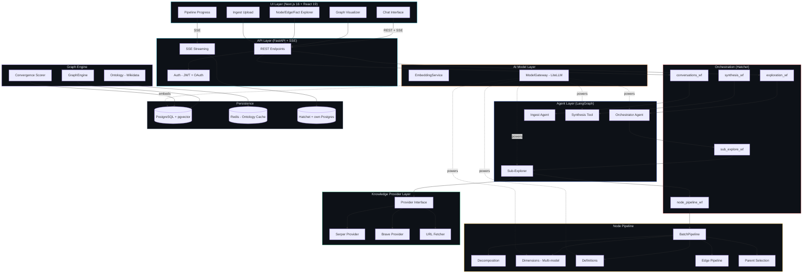
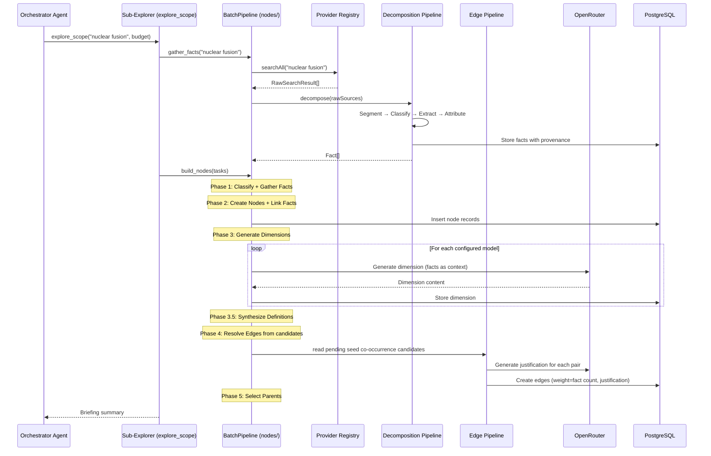
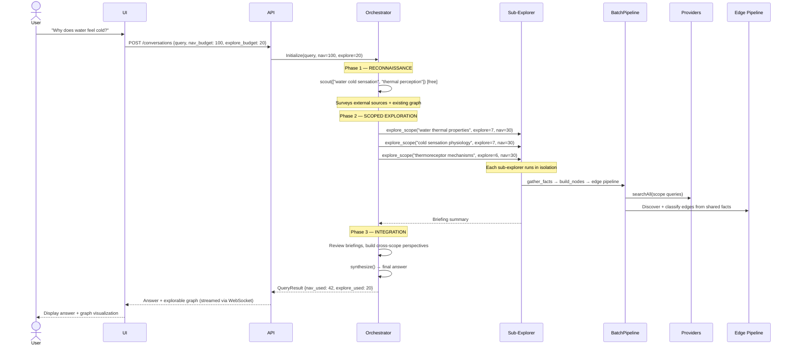
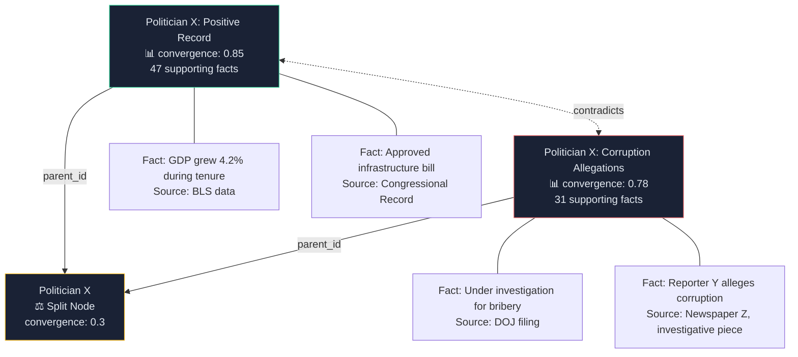
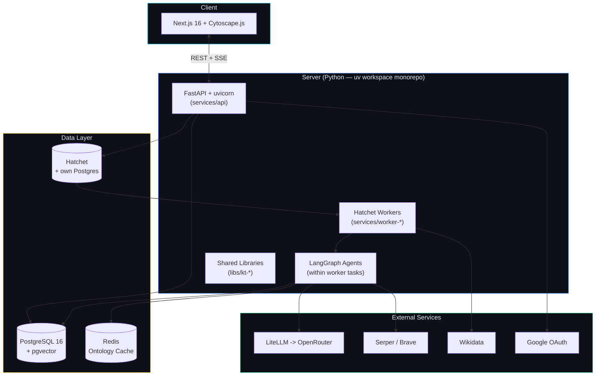

# Knowledge Tree — Requirements & Architecture Specification v1.0

## Table of Contents

1. [Product Vision](#1-product-vision)
2. [System Requirements](#2-system-requirements)
3. [Architecture Overview](#3-architecture-overview)
4. [Data Model](#4-data-model)
5. [Agent Architecture](#5-agent-architecture)
6. [Knowledge Provider Layer](#6-knowledge-provider-layer)
7. [Fact Decomposition Pipeline](#7-fact-decomposition-pipeline)
8. [Graph Engine](#8-graph-engine)
9. [Query & Navigation Flow](#9-query--navigation-flow)
10. [Convergence & Node Splitting](#10-convergence--node-splitting)
11. [Multimodel Dimensional Analysis](#11-multimodel-dimensional-analysis)
12. [API Design](#12-api-design)
13. [UI Requirements](#13-ui-requirements)
14. [Technology Stack](#14-technology-stack)
15. [Implementation Phases](#15-implementation-phases)

---

## 1. Product Vision

A knowledge integration system that builds understanding exclusively from raw external data — never from model internal knowledge. The system constructs and evolves a knowledge graph where every node is grounded in provenance-tracked facts decomposed from real sources.

**Core value proposition:** Over time, frequently queried topics accumulate increasingly rich factual bases. The multi-model, multi-source approach bypasses systemic biases inherent in any single model or source, enabling genuine discovery of patterns that no single perspective would reveal.

**Key design drivers (priority order):**

1. **Knowledge from data, not from models.** Models are reasoning engines, not knowledge sources. All knowledge must trace back to external raw data.
2. **Integration, not ignoring.** The system never discards coherent information. Contradictory facts produce node splits with alternate perspectives, not suppression.
3. **Extensibility.** Clean interfaces allow new knowledge providers (search engines, databases, APIs), new AI models, and new decomposition strategies without architectural changes.
4. **Accumulation.** The graph improves with every query. Nodes visited frequently become deeply supported. Budget=0 queries leverage all prior work.
5. **Transparency.** Users see the graph, the nodes, the facts, the sources, the convergence scores, and the divergences. Nothing is hidden.

---

## 2. System Requirements

### 2.1 Functional Requirements

#### FR-1: Knowledge Graph Management
- **FR-1.1:** The system SHALL maintain a persistent knowledge graph where nodes represent concepts, perspectives, entities, or events. Nodes have a `node_type` field: `concept` (abstract topics), `entity` (named real-world things), `perspective` (debatable claims with a parent concept), or `event` (temporal occurrences).
- **FR-1.2:** Nodes SHALL be linked to other nodes via typed, weighted edges. The graph is flat — all nodes are peers. Perspective nodes link to their parent concept via the `parent_id` FK. Circular references are valid and expected.
- **FR-1.3:** Edges SHALL only be created from shared factual evidence (seed co-occurrence candidates) — semantic proximity alone does NOT create edges. Embedding similarity is a search tool, not a structural mechanism.
- **FR-1.4:** Nodes SHALL reference facts, and facts SHALL reference their original raw sources with stored links.
- **FR-1.5:** Node content size SHALL be configurable (default: 500 tokens per dimension).
- **FR-1.6:** The system SHALL support node splitting when divergent facts form coherent alternate perspectives.
- **FR-1.7:** The system SHALL support node merging when independently created nodes describe the same concept.

#### FR-2: Query & Budget System
- **FR-2.1:** Users SHALL submit queries with a configurable exploration budget (measured in node operations).
- **FR-2.2:** Budget=0 queries SHALL use only existing nodes — no new nodes created, no existing nodes expanded.
- **FR-2.3:** Positive-budget queries SHALL create new nodes or expand existing nodes until budget is exhausted.
- **FR-2.4:** When no new nodes are needed, remaining budget SHALL be used to expand existing nodes with additional data from providers.
- **FR-2.5:** The system SHALL provide a synthesized answer drawn from the navigated graph.
- **FR-2.6:** The system SHALL expose the full subgraph used to generate each answer for user exploration.

#### FR-3: Fact Decomposition
- **FR-3.1:** Raw data from providers SHALL be decomposed by the decomposition pipeline into typed elements: claims, accounts, measurements, formulas, quotes, procedures, references, code, statistical, legal, image, and document.
- **FR-3.2:** Decomposition SHALL be objective — elements are recorded as reported in the source without judgment.
- **FR-3.3:** Each decomposed fact SHALL retain its source attribution (who said it, where, when, in what context).
- **FR-3.4:** Raw source data SHALL be stored for potential reprocessing.
- **FR-3.5:** Facts SHALL be stored persistently and grow over time, forming the system's factual base.

#### FR-4: Knowledge Providers
- **FR-4.1:** The system SHALL use the Brave Search API as the initial knowledge provider.
- **FR-4.2:** The provider interface SHALL be abstract, supporting addition of new providers (other search engines, document stores, custom APIs) without modifying core logic.
- **FR-4.3:** Raw data from all providers SHALL flow into the same fact decomposition pipeline.

#### FR-5: Multimodel Analysis
- **FR-5.1:** Each node SHALL contain dimensions — one per configured AI model.
- **FR-5.2:** Dimensions SHALL be generated independently by each model using the same fact base.
- **FR-5.3:** A convergence report SHALL be auto-generated for each node comparing all dimensions.
- **FR-5.4:** Models SHALL serve as reasoning engines over facts, not as knowledge sources.

#### FR-6: Orchestrator Agent
- **FR-6.1:** An orchestrator agent SHALL plan and execute knowledge graph exploration using tool-based agentic patterns.
- **FR-6.2:** The orchestrator SHALL follow a three-phase strategy: reconnaissance (scout), plan & gather facts, assemble nodes & synthesize.
- **FR-6.3:** Fact gathering (expensive API calls) SHALL be separated from node assembly (organizing existing facts into nodes). This is the "fact pool" pattern.
- **FR-6.4:** The orchestrator SHALL ensure at least two perspectives are explored for debatable topics.
- **FR-6.5:** Exploration SHALL stop when the budget is exhausted or when the agent determines sufficient coverage.
- **FR-6.6:** The legacy Navigation Agent is deprecated but preserved for backward compatibility.

#### FR-7: Source Tracking
- **FR-7.1:** All data added to nodes SHALL have stored links to their original sources.
- **FR-7.2:** Sources SHALL be viewable in the UI as clickable links.
- **FR-7.3:** The provenance chain from node → fact → raw source SHALL be fully traversable.

### 2.2 Non-Functional Requirements

#### NFR-1: Extensibility
- The system SHALL use interface-based design for all provider, model, and storage integrations.
- Adding a new knowledge provider SHALL require implementing a single interface, with no changes to existing code.
- Adding a new AI model SHALL require configuration only, no code changes.

#### NFR-2: Performance
- Budget=0 queries (graph-only, no expansion) SHALL respond within 3 seconds for graphs up to 10,000 nodes.
- Node creation operations SHALL be parallelizable where dependencies allow.
- The system SHALL support concurrent queries from multiple users.

#### NFR-3: Scalability
- The graph SHALL support growth to millions of nodes.
- Vector search SHALL maintain sub-second lookup at scale (via pgvector or equivalent).
- Fact storage SHALL support append-only growth to billions of records.

#### NFR-4: Auditability
- All filter configurations SHALL be versioned and reproducible.
- All AI model calls SHALL be logged with input/output for debugging.
- Every fact's provenance chain SHALL be inspectable.

#### NFR-5: Data Integrity
- Raw source data SHALL be append-only (never modified or deleted).
- Node history SHALL be preserved — updates create new versions, not overwrites.
- The convergence score computation SHALL be deterministic given the same inputs.

---

## 3. Architecture Overview



### Layered Architecture

The system follows a strict layered architecture with dependency inversion at every boundary:

| Layer | Responsibility | Depends On |
|-------|---------------|------------|
| **UI Layer** | Conversation-based research interface, graph visualization, entity browsing, file ingestion | API Layer (REST + SSE) |
| **API Layer** | FastAPI endpoints with JWT/OAuth auth, SSE streaming (`services/api` / `kt_api`) | Orchestration (Hatchet dispatch), Graph Engine |
| **Orchestration Layer** | Hatchet durable workflows: exploration, sub-exploration, node pipeline, synthesis, conversations. Each workflow type runs in its own worker service (`services/worker-*`). | Agent Layer, Node Pipeline |
| **Agent Layer** | LangGraph agents within Hatchet tasks: orchestrator (`kt_worker_orchestrator`), query (`kt_worker_query`), ingest (`kt_worker_ingest`), conversations (`kt_worker_conv`) | Graph Engine, Provider Layer, Model Layer |
| **Node Pipeline** | BatchPipeline 6-phase orchestrator: gather -> create -> dimensions -> definitions -> edges -> parents | Fact Store, Model Layer, Persistence |
| **Graph Engine** | Node CRUD, cross-referencing, convergence scoring, splitting, ontology/ancestry | Fact Store, Persistence, Redis |
| **Fact Store** | Typed fact storage, indexing, deduplication, retrieval by concept | Persistence |
| **Provider Layer** | Raw data fetching from external sources (Serper, Brave, URL fetcher) | External APIs |
| **Ingestion Layer** | File/link upload, content extraction (PDF, DOCX, etc.), partitioning, decomposition | Fact Store, Persistence |
| **Auth Layer** | JWT + Google OAuth + API tokens via fastapi-users | Persistence |
| **Model Layer** | AI model routing with per-agent overrides and thinking levels | OpenRouter / External AI APIs |
| **Persistence** | PostgreSQL + pgvector, Redis (ontology cache), Hatchet (workflow state) | Infrastructure |

---

## 4. Data Model

### 4.1 Entity Relationship Diagram


### 4.2 Core Entities

#### Node
The atomic unit of the knowledge graph. All nodes are flat peers — structure comes from edges. Nodes are typed:

| Node Type | Description | Example |
|-----------|-------------|---------|
| `concept` | Abstract topic, idea, technique, phenomenon, or subject | "moon", "photosynthesis", "pyramid construction techniques" |
| `entity` | A specific real-world thing with a proper name | "NASA" (organization), "Albert Einstein" (person), "Paris" (location) |
| `perspective` | A debatable claim with a parent concept | "the moon is an artificial structure placed in orbit" |
| `event` | A temporal occurrence (historical, scientific, ongoing) | "Apollo 11 Moon Landing", "2024 Solar Eclipse" |

Perspective nodes have a `parent_id` FK linking them to their parent concept node. Parent-child structure uses this FK, not edges.

```
Node:
  id:                 uuid                # primary key
  concept:            string              # human-readable concept label
  node_type:          string              # "concept" | "perspective" | "entity" | "event" (default: "concept")
  parent_id:          uuid | null         # FK to parent node (tree structure)
  source_concept_id:  uuid | null         # FK to source concept for derived nodes
  definition:         text | null         # synthesized definition from dimensions
  embedding:          float[]             # averaged across dimension embeddings
  attractor:          string              # which attractor this node serves
  filter_id:          string              # which filter config produced it
  max_content_tokens: int                 # configurable per node, default 500
  created_at:         timestamp
  updated_at:         timestamp
  stale_after:        duration            # default 30 days
  update_count:       int                 # times refreshed
  access_count:       int                 # times accessed in queries (drives accumulation)
```

#### Edge
The structural unit of the graph. Connects two nodes with a typed relationship grounded in shared facts. Edges are created from seed co-occurrence candidates — when a fact mentions multiple seeds during decomposition, those seeds become edge candidates. The edge pipeline reads these candidates, generates an LLM justification, and creates the edge.

```
Edge:
  id:                 uuid
  source_node_id:     uuid                # one end (canonical: smaller UUID)
  target_node_id:     uuid                # other end (canonical: larger UUID)
  relationship_type:  string              # "related" | "cross_type" | "contradicts"
  weight:             float               # shared fact count (positive, higher = stronger)
  justification:      text | null         # LLM reasoning with {fact:uuid} citation tokens
  created_by_query:   uuid                # which query's exploration created this edge
  created_at:         timestamp
  metadata:           jsonb               # type-specific context
```

**Key design principle:** Embedding proximity does NOT create edges. An edge exists because facts explicitly mention both concepts — every edge is grounded in shared factual evidence. Two nodes can be semantically close (similar embeddings) yet have no edge if no facts mention both.

**Circular references are valid.** "Water" can link to "hydrogen" and "hydrogen" can link to "water." This is not a bug — it reflects real conceptual structure. The Navigation Agent handles cycles via its `visited_nodes` set.

#### Fact
The atomic unit of knowledge derived from raw sources. Facts are typed and objective.

```
Fact:
  id:            uuid
  content:       text                # the factual claim as extracted from source
  fact_type:     enum                # see Fact Types below
  embedding:     float[]             # for semantic search
  metadata:      jsonb               # type-specific metadata
  created_at:    timestamp

Fact Types:
  - "claim"            # factual claim from a source
  - "account"          # first-person or narrative account
  - "measurement"      # quantitative measurement
  - "formula"          # mathematical or scientific formula
  - "quote"            # direct quotation with attribution
  - "procedure"        # process, method, or step-by-step instructions
  - "reference"        # citation or pointer to another source
  - "code"             # code snippet or technical implementation
  - "statistical"      # statistical data point or analysis
  - "legal"            # legal ruling, legislation, regulation
  - "image"            # visual content description
  - "document"         # document-level metadata or summary
```

#### Fact Source (Provenance Link)
Links a fact to its raw source with attribution context.

```
FactSource:
  id:              uuid
  fact_id:         uuid               # which fact
  raw_source_id:   uuid               # which raw source
  context_snippet: text               # the specific text that supports this fact
  attribution:     string             # "Dr. X, University of Y" or "Reporter Z, Company W"
```

#### Raw Source
Append-only storage of all raw data ever fetched.

```
RawSource:
  id:               uuid
  uri:              string            # URL or document identifier
  title:            string
  raw_content:      text              # full text content
  content_hash:     string            # SHA-256 for dedup
  provider_id:      string            # which provider fetched it
  retrieved_at:     timestamp
  provider_metadata: jsonb            # provider-specific data (search rank, etc.)
```

### 4.3 Relationship Types (EDGE)

Edge types are limited to 3 well-separated values. All edges are undirected with canonical UUID ordering enforced (smaller UUID always stored as `source_node_id`). The `weight` field is a **shared fact count** (positive float) — higher values indicate stronger evidence for the relationship.

| Type | Category | Meaning | Example |
|------|----------|---------|---------|
| `related` | Same-type | Connects nodes of the same `node_type`. Created from seed co-occurrence candidates. | "solar power" ↔ "wind power" (both concepts) |
| `cross_type` | Cross-type | Connects nodes of different `node_type`s (e.g., entity↔event, perspective↔concept). Eligible pairings defined in `nodes/edges/types.py`. | "NASA" (entity) ↔ "Apollo 11" (event) |
| `contradicts` | Dialectic | Links thesis/antithesis perspective pairs. Created by the perspective builder during dialectic pair construction. | "AI is beneficial" ↔ contradicts ↔ "AI is dangerous" |

Edge `weight` = number of shared facts between the two nodes' seeds. The `justification` field contains LLM-generated reasoning with `{fact:uuid}` citation tokens for provenance.

**Edge creation pipeline** (`nodes/edges/`): Candidate-based process — (1) during fact decomposition, seed co-occurrence creates `write_edge_candidates` rows for each fact mentioning multiple seeds; (2) when a node is built, `EdgeResolver.resolve_from_candidates()` reads pending candidates, loads shared facts, calls the LLM for a justification, and creates the edge with weight = fact count. Relationship type is determined by node types: same type → `related`, different types → `cross_type`.

### 4.4 Edges vs. Embedding Similarity

| | Edges | Embedding Similarity |
|---|-------|---------------------|
| **Created by** | Seed co-occurrence candidates + LLM justification (edge pipeline), or perspective builder | Computed automatically from content |
| **Meaning** | "These concepts are meaningfully related — I explored them together" | "These concepts have similar semantic content" |
| **Used for** | Graph traversal, answer synthesis, UI visualization | Node search, dedup candidate detection, merge candidate detection |
| **Circular?** | Yes — A→B and B→A are both valid | N/A (similarity is symmetric) |
| **Grows with use** | Yes — more queries = more edges discovered | No — determined by content |

Semantic search is a **tool** the agent uses to find candidate nodes. Edges are created from seed co-occurrence data — when the same fact mentions multiple seeds, those seeds become edge candidates.

---

## 5. Agent Architecture

The system uses specialized agents, each with clearly defined tools and responsibilities. Agents use LangGraph's stateful tool-calling patterns.

### 5.0 Orchestrator Agent (Primary Entry Point)

**Role:** The strategic coordinator. Receives a user query, plans exploration, delegates fact gathering and node building to specialized tools, assesses evidence gaps, and triggers synthesis. Replaces the Navigation Agent as the primary query entry point.

The Orchestrator separates **fact gathering** (expensive external API calls) from **node assembly** (organizing existing facts into structural nodes). This "fact pool" pattern allows facts to be gathered once and assembled into multiple nodes without redundant API calls.

#### 5.0.1 Three-Phase Strategy

1. **RECONNAISSANCE** — Call `scout()` (free) to survey external sources and existing graph. Understand what exists, what's stale, what's missing.
2. **SCOPED EXPLORATION** — Based on reconnaissance, plan 3-5 focused scopes covering different angles. Launch `explore_scope()` for each. Each sub-explorer gathers facts, builds concepts/entities/perspectives within its scope, and returns a briefing summary.
3. **INTEGRATION** — Review sub-explorer briefings. Use `build_perspective()` for cross-scope perspectives. Call `synthesize()` when all angles are covered.

#### 5.0.2 Orchestrator Tools

| Tool | Purpose | Cost |
|------|---------|------|
| `scout(queries)` | Reconnaissance — returns search titles/snippets AND existing graph matches with richness/staleness info | Free |
| `explore_scope(scope, explore_budget, nav_budget)` | Launch an isolated sub-explorer agent to investigate a focused scope. Sub-explorer gathers facts, builds concepts/entities/perspectives, and returns a briefing | Allocated explore_budget |
| `build_perspective(claim, parent_concept_id)` | Assembles a perspective node from the fact pool with stance classification. Used for cross-scope integration after sub-explorers finish | Free if facts in pool; 1 explore_budget if search needed |
| `read_node(node_id)` / `read_nodes(node_ids)` | Read node dimensions, edges, and suggested_concepts. Inspects nodes built by sub-explorers | 1 nav_budget per unvisited node |
| `get_node_facts(node_id)` / `get_nodes_facts(node_ids)` | Inspect a node's facts with stance labels | Free if visited; 1 nav_budget if unvisited |
| `get_budget()` | Check remaining nav and explore budgets | Free |
| `synthesize()` | Generate final answer from all assembled nodes | Free |

#### 5.0.3 Fact Pool Pattern

Facts are gathered into a shared pool via `gather_facts()` (within sub-explorers), then assembled into nodes via `build_concept()` / `build_entity()` / `build_perspective()`. This separation means:
- A single gather operation can supply facts to multiple nodes
- Facts can be reorganized into different structural arrangements without re-fetching
- Stance classification happens at assembly time, not gather time
- The expensive operation (external search) is decoupled from the cheap operation (node assembly)

#### 5.0.4 Perspective-Aware Assembly

When building perspective nodes, the system:
1. Searches the fact pool for facts relevant to the claim
2. Classifies each fact's stance relative to the claim: `supports`, `challenges`, or `neutral`
3. Creates the perspective node with `node_type="perspective"` and `parent_concept_id`
4. Links facts with their stance classification
5. Generates a "credulous" dimension — building the strongest case for this position
6. Sets the `parent_id` FK to the parent concept node
7. For dialectic pairs (thesis/antithesis), creates a `contradicts` edge. For sibling perspectives, edges are created from seed co-occurrence candidates via the standard edge pipeline.

#### 5.0.5 Staleness-Aware Budget Allocation

The orchestrator considers node staleness when planning:
- Fresh, rich nodes → READ (free), don't recreate
- Stale nodes → REFRESH with new fact gathering (costs 1 explore_budget)
- Missing nodes → CREATE from fact pool or with new gathering
- Thin areas → DEEPEN with additional fact gathering

### 5.1 Navigation Agent (Deprecated)

> **Deprecated:** The Navigation Agent is superseded by the Orchestrator Agent (Section 5.0). It is preserved for backward compatibility but new queries use `run_orchestrator`.

**Role:** The original central intelligence of the system. Receives a user query, navigates and expands the knowledge graph to build sufficient understanding, then synthesizes an answer.

#### 5.1.1 Input & State

```
NavigationAgent:
  input:
    query:          string        # user's question
    nav_budget:     int           # max nodes to read/visit (graph traversal width)
    explore_budget: int           # max create/expand operations (knowledge creation)
    config:         QueryConfig   # attractor, filter, model set

  state:
    visited_nodes:       Set<uuid>     # nodes read during this query (prevents cycles)
    created_nodes:       Set<uuid>     # nodes created during this query
    expanded_nodes:      Set<uuid>     # nodes expanded with new facts
    created_edges:       List<Edge>    # edges created during this query
    remaining_nav:       int           # decrements with each read_node
    remaining_explore:   int           # decrements with create/expand (not reads)
    exploration_path:    List<uuid>    # ordered path through graph
    context_summary:     string        # running summary of what the agent knows so far
```

#### 5.1.2 Tools

Each tool has a defined purpose, inputs, outputs, and budget cost. The agent selects tools based on its reasoning about what knowledge is needed next.

---

**Tool: `read_node`**

```
read_node(concept_or_id: string) → Node | null

Purpose:  Read an existing node from the graph. Returns the node with its
          dimensions, convergence report, fact count, and a computed richness
          score. Returns null if the node does not exist.

Returns:
  Node:
    id, concept, dimensions[], convergence_report,
    fact_count, richness_score, edge_count, last_updated

  richness_score: float 0-1
    Computed as: weighted(fact_count, dimension_count, convergence_score, freshness)
    0.0-0.3 = thin (few facts, low confidence)
    0.3-0.7 = moderate (some coverage, room to expand)
    0.7-1.0 = rich (well-supported, high convergence, recent)

Budget:   Consumes 1 nav_budget unit.
          Returns null (without consuming budget) if node does not exist.

Behavior: If the node exists in visited_nodes, returns cached version (no budget cost).
          Otherwise reads from DB, adds to visited_nodes, decrements nav_budget.
```

---

**Tool: `explore_concept`**

```
explore_concept(concept: string) → ExploreResult

Purpose:  The primary knowledge-building tool. The agent says "I need to understand
          this concept" and the system decides HOW to fulfill that need:

          1. If no node exists for this concept → CREATE a new node
             (provider fetch → decomposition → dimension generation)
          2. If a node exists but is thin (richness < 0.3) → EXPAND it
             (additional provider fetch → decomposition → regenerate dimensions)
          3. If a node exists and is rich (richness >= 0.3) → READ it
             (return existing node, no external calls)

Returns:
  ExploreResult:
    node:              Node         # the resulting node (created, expanded, or existing)
    action_taken:      "created" | "expanded" | "read"
    new_facts_count:   int          # how many new facts were added (0 if read)
    suggested_concepts: string[]    # concepts this node suggests for further exploration

Budget:   - "created" or "expanded" → consumes 1 explore_budget unit
          - "read" → consumes 1 nav_budget unit (same as read_node)
          The agent does NOT need to decide create vs expand vs read.
          Budget is only consumed when actual work happens.

Behavior: This is the workhorse tool. The agent's job is to decide WHAT concept
          to explore. The system decides WHETHER that requires creation, expansion,
          or just reading, based on the node's current state.
```

---

**Tool: `search_nodes`**

```
search_nodes(query: string, limit: int = 10) → NodeSummary[]

Purpose:  Semantic vector search over existing nodes. Finds nodes whose concepts
          are semantically similar to the query. This is a DISCOVERY tool — it
          helps the agent find what's already in the graph. It does NOT create
          any edges or nodes.

Returns:
  NodeSummary[]:
    id, concept, richness_score, fact_count, convergence_score,
    similarity_score (to the query)

Budget:   Does NOT consume any budget. Search is always free.

Use when: Starting exploration (find existing relevant nodes), identifying
          gaps (what's NOT in the graph), finding connection candidates.
```

---

**Tool: `connect`**

```
connect(source_id: uuid, target_id: uuid) → Edge

Purpose:  Tells the system "these two nodes are related in the context of my
          current exploration." The SYSTEM computes the relationship type and
          weight — the agent just identifies the connection.

          The system determines:
          - relationship_type: same node type → "related", different → "cross_type"
          - weight: number of shared facts between the nodes' seeds

Returns:
  Edge:
    id, source_node_id, target_node_id, relationship_type, weight,
    created_by_query

Budget:   Does NOT consume budget. Connecting is part of exploration,
          not a separate billable operation.

Behavior: If an edge already exists between these nodes, updates it with
          the latest fact count and justification.
```

---

**Tool: `get_neighbors`**

```
get_neighbors(node_id: uuid, types: string[]? = null) → NeighborResult[]

Purpose:  Returns all nodes connected to the given node via edges.
          Optionally filtered by edge type. This is how the agent traverses
          the graph structure — following existing connections.

Returns:
  NeighborResult[]:
    node: NodeSummary   # the connected node
    edge: Edge          # the edge connecting them
    direction: "outgoing" | "incoming"

Budget:   Does NOT consume budget. Traversal is free.

Use when: Following the graph from a node to discover what's already connected,
          identifying which branches need deeper exploration.
```

---

**Tool: `get_node_facts`**

```
get_node_facts(node_id: uuid, types: string[]? = null) → FactWithSource[]

Purpose:  Returns all facts linked to a node, with their original sources.
          Optionally filtered by fact type (experiment, observation, opinion, etc.).
          Allows the agent to inspect the evidence base of a node.

Returns:
  FactWithSource[]:
    fact: Fact          # content, type, attribution
    sources: Source[]   # original raw sources with URIs

Budget:   Does NOT consume budget.

Use when: Evaluating node quality, understanding what evidence supports a claim,
          deciding whether a node needs expansion.
```

---

**Tool: `summarize_subgraph`**

```
summarize_subgraph(node_ids: uuid[]) → SubgraphSummary

Purpose:  When the agent has explored a large or wide section of the graph,
          this tool compresses the visited nodes into a structured summary.
          Prevents context window overflow on complex queries. The agent can
          use the summary to reason about the overall picture without holding
          every node's full content in context.

Returns:
  SubgraphSummary:
    summary:            string      # narrative summary of the subgraph
    key_claims:         string[]    # most important converged claims
    open_questions:     string[]    # identified gaps or low-convergence areas
    node_count:         int
    avg_convergence:    float

Budget:   Does NOT consume budget. Summarization uses the synthesis model
          but is an internal reasoning aid, not knowledge creation.

Use when: After exploring 20+ nodes, before deciding next steps.
          When the exploration is becoming too wide and the agent needs
          to refocus on what matters for answering the original query.
```

---

**Tool: `synthesize_answer`**

```
synthesize_answer(query: string, node_ids: uuid[]) → Answer

Purpose:  Final step. Given the original query and the set of explored nodes,
          generates a comprehensive answer grounded in the graph's knowledge.
          The answer cites facts and sources transparently.

Returns:
  Answer:
    text:              string       # the synthesized answer
    confidence:        float 0-1    # derived from convergence scores
    cited_facts:       FactRef[]    # which facts were used, with source links
    cited_nodes:       uuid[]       # which nodes contributed
    divergences:       Divergence[] # where models/facts disagreed (presented transparently)
    subgraph:          GraphSnapshot # for UI visualization

Budget:   Does NOT consume budget.

Behavior: Uses converged claims as primary content. Presents divergences transparently:
          "Evidence agrees that X. On Y, there are competing perspectives: [A] vs [B]."
          Every claim in the answer traces to specific facts and sources.
```

#### 5.1.3 Agent Process (Step by Step)

The Navigation Agent follows this process for every query. The core intelligence is in **step 4a** — deciding what concept to explore next.

```
PROCESS:

1. RECEIVE QUERY
   Input: query, nav_budget, explore_budget, config
   Initialize state: visited_nodes={}, remaining_nav=nav_budget, remaining_explore=explore_budget

2. DECOMPOSE QUERY INTO INITIAL CONCEPTS
   The agent parses the query into its constituent concepts.
   Example: "Why does water feel cold?" → ["water", "cold sensation", "thermal perception"]

3. SEARCH EXISTING GRAPH
   For each initial concept:
     results = search_nodes(concept)
     For each result with high similarity:
       node = read_node(result.id)              # costs 1 nav_budget
       neighbors = get_neighbors(node.id)        # free
       Add node + neighbor summaries to working context

4. EXPLORATION LOOP (core agent reasoning)
   While (remaining_nav > 0 OR remaining_explore > 0) AND agent determines gaps exist:

     a. IDENTIFY NEXT CONCEPT (this is where the AI reasons)
        Based on:
        - The original query (what are we trying to answer?)
        - What we know so far (visited nodes, their content, their gaps)
        - What suggested_concepts have been returned by explore_concept
        - What the agent's own reasoning identifies as missing
        The agent decides: "I need to understand [concept X] next"

     b. EXPLORE
        result = explore_concept(concept_x)
        # System handles: create if new, expand if thin, read if rich
        # Budget consumed only if creation/expansion actually happens

     c. CONNECT
        For each visited node that is meaningfully related to the new/explored node:
          connect(result.node.id, related_node.id)
        # System computes relationship types and weights

     d. ASSESS
        - Is the working context getting large? → summarize_subgraph(visited_node_ids)
        - Does the agent have enough to answer? → exit loop
        - Are there still important gaps? → continue loop
        - Is budget running low? → prioritize most important remaining gaps

5. SYNTHESIZE
   answer = synthesize_answer(query, visited_node_ids)
   Return answer + exploration metadata to the caller

EXIT CONDITIONS (any of these ends the loop):
  - remaining_nav = 0 AND remaining_explore = 0 (budget exhausted)
  - Agent determines sufficient coverage to answer the query
  - No more gaps identified (all relevant concepts explored)
  - Max iterations reached (safety limit, configurable, default 200)
```

#### 5.1.4 Budget Interaction

```
Budget cost summary:

  read_node            →  1 nav_budget
  explore_concept      →  1 explore_budget (if create/expand) OR 1 nav_budget (if read)
  search_nodes         →  free
  connect              →  free
  get_neighbors        →  free
  get_node_facts       →  free
  summarize_subgraph   →  free
  synthesize_answer    →  free

The two budgets serve different purposes:
  nav_budget:     "How wide can I look?" (cheap — DB reads)
  explore_budget: "How much new knowledge can I create?" (expensive — API calls)

Examples:
  nav=0,   explore=0   → Nothing. System reports query needs budget.
  nav=100, explore=0   → Read-only. Traverse existing graph, synthesize from what exists.
  nav=100, explore=20  → Standard. Navigate existing graph, fill 20 gaps with new knowledge.
  nav=500, explore=100 → Deep. Extensive navigation and aggressive knowledge creation.
```

#### 5.1.5 Cycle Handling

The `visited_nodes` set prevents infinite loops in circular graphs. If the agent navigates A→B→C→A, when it reaches A the second time, `read_node` returns the cached version without consuming budget. The agent recognizes it has already visited A and moves on.

---

### 5.2 Decomposition Agent

**Role:** Receives raw data from providers. Decomposes it into typed facts with full attribution. No judgment — only objective decomposition of what the source says.

This agent is called internally by `explore_concept` when creating or expanding a node. It is not called directly by the Navigation Agent.

#### 5.2.1 Tools

```
classify_segment(text: string) → ContentType
  Purpose:  Classifies a text passage as experiment, observation, opinion, etc.
  Returns:  One of the FactType enum values.

extract_facts(text: string, content_type: ContentType) → RawFact[]
  Purpose:  Extracts individual factual claims from a classified passage.
  Returns:  List of facts, each with content and type.

extract_attribution(text: string, fact: RawFact) → Attribution
  Purpose:  Identifies who said/reported this fact and in what context.
  Returns:  Attribution { who, role, affiliation, context, date, location }

store_fact(fact: RawFact, attribution: Attribution, source: RawSource) → uuid
  Purpose:  Persists the fact with its provenance link. Checks for duplicates
            via embedding similarity — if a near-duplicate exists, links the
            new source to the existing fact instead of creating a duplicate.
  Returns:  Fact ID (new or existing).
```

#### 5.2.2 Process

```
Input:  raw_sources: RawSource[], concept: string

1. For each raw source:
   a. Segment the text into logical passages
      - Paragraph-level for articles
      - Section-level for academic papers
      - Sentence-level for dense factual content

   b. For each passage:
      i.   content_type = classify_segment(passage)
      ii.  facts = extract_facts(passage, content_type)
      iii. For each fact:
           - attribution = extract_attribution(passage, fact)
           - fact_id = store_fact(fact, attribution, raw_source)

2. Return all extracted fact IDs

DECOMPOSITION RULES (the agent follows these strictly):
  - Experiments:  Record methodology, results, who conducted, when, where published.
  - Observations: Record what was observed, by whom, under what conditions.
  - Measurements: Record the value, units, methodology, source dataset.
  - Opinions:     Record the opinion, who holds it, their affiliation, context.
                  ALWAYS attribute. "X is bad" → "Reporter Y stated X is bad (Company Z, editorial)."
  - Claims:       Record the claim, source, and whether evidence is cited in the source.
  - Testimony:    Record the account, who gave it, their relationship to events.
  - Stories:      Record the narrative, its source, the narrator.

The agent does NOT evaluate truth. It decomposes and attributes.
```

---

### 5.3 Synthesis Agent

**Role:** Given a set of navigated nodes with their facts, dimensions, and convergence reports, produces a coherent answer to the user's query. Called by the Orchestrator's `synthesize()` tool.

#### 5.3.1 Perspective-Aware Synthesis

The synthesis agent groups nodes by type when building context:

```
## Core Concepts
- Moon [concept] — 12 facts (last updated: 2 days ago)

## Perspectives on "Moon"
### "The moon formed naturally via giant impact" [perspective]
- Parent: Moon
- 18 supporting facts, 3 challenging facts

### "The moon is an artificial structure" [perspective]
- Parent: Moon
- 6 supporting facts, 12 challenging facts
```

When perspectives are present, the synthesis agent:
1. Presents EACH perspective with its strongest supporting facts
2. Counts and compares evidence: quantity, source quality, diversity
3. Notes evidence ASYMMETRY and reasons about what it means
4. Flags cognitive manipulation tactics (appeals to authority, ad hominem, conspiracy logic)
5. Renders a verdict clearly labeled as synthesis, not fact
6. The verdict weighs evidence but never dismisses a perspective without engaging its arguments

Facts displayed in synthesis include stance labels:
```
- [claim] [SUPPORTS] The moon rings like a bell when struck (who: NASA; source: Apollo data) {fact:uuid}
- [measurement] [CHALLENGES] Seismic ringing consistent with solid mantle (who: USGS; source: Geophysics Journal) {fact:uuid}
```

#### 5.3.2 Process

```
Input:  query: string, node_ids: uuid[]

1. Load full content for all specified nodes (dimensions, convergence, facts with stances)

2. Group nodes by type: concepts, perspectives (grouped by parent), other

3. Build the answer:
   - For concepts: use convergence report's recommended_content
   - For perspectives: present each perspective with supporting/challenging evidence
   - Where convergence is high (>0.7), present claims as established
   - Where convergence is moderate (0.4-0.7), note the uncertainty
   - Where convergence is low (<0.4), present competing perspectives explicitly

4. Cite provenance throughout with stance labels

5. Present divergences transparently

6. Package the subgraph (nodes + edges) for UI visualization

Output: Answer { text, confidence, cited_facts, cited_nodes, divergences, subgraph }
```

---

### 5.4 Conversation Agent

**Role:** Wraps the Orchestrator for follow-up turns in a conversation. Operates with smaller default budgets (nav=10, explore=2) and prior conversation context (original query, prior answer, visited nodes).

Uses the same orchestrator tools (scout, explore_scope, build_perspective, read_node, get_node_facts, get_budget, synthesize) but with a conversation-aware system prompt that focuses on:
1. NEW information not in the prior answer
2. DEEPER exploration of what the user specifically asked about
3. DIFFERENT perspectives or angles the user is seeking

The synthesis agent sees the prior answer and builds on it rather than repeating known information.

### 5.5 Agent Tool Interface (Python)

All agent tools follow a consistent interface for LangGraph compatibility:

```python
from pydantic import BaseModel
from typing import Generic, TypeVar

TInput = TypeVar("TInput", bound=BaseModel)
TOutput = TypeVar("TOutput", bound=BaseModel)

class AgentTool(Generic[TInput, TOutput]):
    """Base class for all agent tools."""
    name: str
    description: str                    # Used by the LLM to decide when to call this tool
    input_schema: type[TInput]
    output_schema: type[TOutput]

    async def execute(self, input: TInput, context: AgentContext) -> TOutput:
        raise NotImplementedError

class AgentContext(BaseModel):
    """Shared context available to all tools during a query."""
    query_id: str
    nav_budget: int
    explore_budget: int
    nav_used: int
    explore_used: int
    graph_engine: GraphEngine           # injected, not serialized
    provider_registry: ProviderRegistry
    model_gateway: ModelGateway
```

---

## 6. Knowledge Provider Layer

### 6.1 Provider Interface

```typescript
interface KnowledgeProvider {
  readonly providerId: string;
  readonly displayName: string;

  /**
   * Search for raw data related to a concept.
   * Returns raw results that will be stored and then decomposed.
   */
  search(query: string, options: SearchOptions): Promise<RawSearchResult[]>;

  /**
   * Fetch the full content of a specific resource.
   * Used when a search result needs deeper extraction.
   */
  fetch(uri: string): Promise<RawContent>;

  /**
   * Health check for this provider.
   */
  isAvailable(): Promise<boolean>;
}

interface SearchOptions {
  maxResults: number;       // default 10
  freshness?: string;       // "day", "week", "month", "year"
  language?: string;        // default "en"
  region?: string;
  safeSearch?: boolean;
}

interface RawSearchResult {
  uri: string;
  title: string;
  snippet: string;
  metadata: Record<string, unknown>;  // provider-specific
}

interface RawContent {
  uri: string;
  title: string;
  content: string;          // full text content
  contentType: string;      // "text/html", "application/pdf", etc.
  metadata: Record<string, unknown>;
}
```

### 6.2 Provider Registry

```typescript
class ProviderRegistry {
  private providers: Map<string, KnowledgeProvider> = new Map();

  register(provider: KnowledgeProvider): void;
  unregister(providerId: string): void;
  get(providerId: string): KnowledgeProvider;
  getAll(): KnowledgeProvider[];

  /**
   * Search across all registered providers.
   * Deduplicates results by URI.
   */
  searchAll(query: string, options: SearchOptions): Promise<RawSearchResult[]>;
}
```

### 6.3 Brave Search Provider (Initial Implementation)

```typescript
class BraveSearchProvider implements KnowledgeProvider {
  readonly providerId = "brave_search";
  readonly displayName = "Brave Search";

  constructor(private config: BraveSearchConfig) {}

  async search(query: string, options: SearchOptions): Promise<RawSearchResult[]> {
    // Calls Brave Search API
    // Maps Brave results to RawSearchResult format
    // Stores raw response in RawSource table
  }

  async fetch(uri: string): Promise<RawContent> {
    // Fetches and extracts content from a specific URL
    // Stores raw content in RawSource table
  }
}
```

### 6.4 Adding a New Provider

To add a new provider (e.g., Google Scholar, ArXiv, a proprietary database):

1. Implement the `KnowledgeProvider` interface
2. Register with the `ProviderRegistry`
3. Configure in provider config YAML

No changes to agents, graph engine, or UI required.

---

## 7. Fact Decomposition Pipeline

### 7.1 Pipeline Flow


### 7.2 Segmentation

Raw text is split into logical passages. Each passage is a candidate for fact extraction.

```
Segmentation strategies:
  - Paragraph-level splitting for articles
  - Section-level splitting for academic papers
  - Sentence-level for dense factual content
  - The segmenter is adaptive — it uses the content classifier to determine granularity
```

### 7.3 Classification

Each segment receives a content type classification:

| Type | Description | Example |
|------|-------------|---------|
| `claim` | Factual claim from a source | "The company claims 99.9% uptime" |
| `account` | First-person or narrative account | "The project began in 2019 when..." |
| `measurement` | Quantitative data point | "The sample measured 3.7 ± 0.2 nm" |
| `formula` | Mathematical or scientific formula | "E = mc²" |
| `quote` | Direct quotation with attribution | "According to Dr. Smith, 'this is unprecedented'" |
| `procedure` | Process, method, or step-by-step instructions | "First, heat the solution to 100°C, then..." |
| `reference` | Citation or pointer to another source | "See Smith et al. (2024) for details" |
| `code` | Code snippet or technical implementation | "The function returns `sorted(data, key=lambda x: x.score)`" |
| `statistical` | Statistical analysis or dataset | "GDP grew 2.4% in Q3 2024" |
| `legal` | Legal text or ruling | "The court ruled in favor of the plaintiff" |
| `image` | Visual content description | "Figure 3 shows the protein folding structure" |
| `document` | Document-level metadata or summary | "This 2024 WHO report covers global health trends" |

### 7.4 Attribution Extraction

For every fact, the system extracts:

```
Attribution:
  who:          string    # person, organization, or "anonymous"
  role:         string    # "researcher", "reporter", "witness", "company spokesperson"
  affiliation:  string    # organization, publication, institution
  context:      string    # "editorial", "peer-reviewed paper", "press conference"
  date:         string    # when the claim was made
  location:     string    # where (if relevant)
```

### 7.5 Deduplication

Before storing, facts are checked against existing facts via embedding similarity:

```
if cosine_similarity(new_fact.embedding, existing_fact.embedding) > 0.92:
  # Link new source to existing fact (adds provenance, doesn't duplicate)
  link_source_to_fact(existing_fact, new_source)
else:
  # Store as new fact
  store_fact(new_fact)
```

This means a single fact (e.g., "water boils at 100C at sea level") may accumulate many independent sources over time, strengthening its factual standing.

---

## 8. Graph Engine

### 8.1 Core Interface

```typescript
interface GraphEngine {
  // Node operations
  createNode(concept: string): Promise<Node>;
  getNode(id: string): Promise<Node | null>;
  getNodeByConcept(concept: string): Promise<Node | null>;
  updateNode(id: string, updates: Partial<Node>): Promise<Node>;

  // Semantic search (tool for agents — does NOT create structure)
  searchNodes(query: string, limit?: number): Promise<NodeSearchResult[]>;
  findSimilarNodes(embedding: number[], threshold?: number): Promise<Node[]>;

  // Edge operations (flat graph — no parent/child, weight = fact count)
  createEdge(source: string, target: string, type: string, weight: number,
             justification?: string, factIds?: string[]): Promise<Edge>;
  getEdges(nodeId: string, options?: {
    direction?: "outgoing" | "incoming" | "both";
    types?: string[];
  }): Promise<Edge[]>;
  getNeighbors(nodeId: string, options?: {
    types?: string[];
    depth?: number;         // how many hops to follow (default 1)
  }): Promise<Node[]>;

  // Subgraph extraction (for visualization)
  getSubgraph(nodeIds: string[], depth?: number): Promise<GraphSnapshot>;

  // Fact linking
  linkFactToNode(nodeId: string, factId: string, relevance: number): Promise<void>;
  getNodeFacts(nodeId: string, types?: string[]): Promise<FactWithSources[]>;

  // Dimensions
  addDimension(nodeId: string, dimension: Dimension): Promise<void>;
  getDimensions(nodeId: string): Promise<Dimension[]>;

  // Convergence
  computeConvergence(nodeId: string): Promise<ConvergenceReport>;

  // Splitting (creates new nodes + perspective_of edges, not parent-child)
  splitNode(nodeId: string, perspectives: PerspectiveDefinition[]): Promise<{
    perspectiveNodes: Node[];
    edges: Edge[];
  }>;

  // Merging (combine duplicate nodes)
  mergeNodes(sourceId: string, targetId: string): Promise<Node>;

  // Versioning
  getNodeHistory(nodeId: string): Promise<NodeVersion[]>;
}

// GraphSnapshot is what the UI renders
interface GraphSnapshot {
  nodes: Node[];
  edges: Edge[];
}
```

**Note:** There is no `getParent()` or `getChildren()` — the graph is flat. Use `getEdges()` or `getNeighbors()` to traverse in any direction. Circular traversal is handled by the caller (agent tracks visited nodes).

### 8.2 Node Creation Flow



### 8.3 Semantic Search as Navigation Tool

Semantic search (embedding similarity) is available to agents as a tool for finding candidate nodes during exploration. It does NOT automatically create edges.

Edges are created by the `EdgePipeline` from seed co-occurrence candidates — facts that mention multiple seeds during decomposition create `write_edge_candidates` rows. The edge pipeline reads these candidates, generates an LLM justification, and creates edges with weight = shared fact count. The separation between "semantically similar" and "meaningfully related based on shared evidence" is fundamental to the system.

---

## 9. Query & Navigation Flow

### 9.1 End-to-End Query Flow



### 9.2 Dual Budget System

The system uses two independent budgets to give precise cost control. Exploring existing knowledge (reading nodes, traversing edges) is vastly cheaper than creating new knowledge (provider calls, decomposition, dimension generation). Separating the budgets lets users control each dimension independently.

```
Two budgets:

  NAVIGATION BUDGET (nav_budget):
    Controls how wide the agent explores the existing graph.
    Measured in nodes read/visited.
    Example: nav_budget=50 means the agent can visit up to 50 existing nodes.
    Cost: cheap (DB reads, no external API calls)

  EXPLORATION BUDGET (explore_budget):
    Controls how much new knowledge the agent can create.
    Measured in node operations (create + expand).
    Example: explore_budget=10 means up to 10 new nodes created or existing nodes expanded.
    Cost: expensive (provider API calls, decomposition, model calls for dimensions)
```

**Operation costs by budget type:**

| Operation | Nav Budget | Explore Budget | Notes |
|-----------|-----------|---------------|-------|
| `read_node` | 1 unit | 0 | Read existing node |
| `explore_concept` (→ read) | 1 unit | 0 | Node exists and is rich |
| `explore_concept` (→ create) | 0 | 1 unit | Node doesn't exist |
| `explore_concept` (→ expand) | 0 | 1 unit | Node exists but is thin |
| `search_nodes` | 0 | 0 | Always free |
| `connect` | 0 | 0 | Always free |
| `get_neighbors` | 0 | 0 | Always free |
| `get_node_facts` | 0 | 0 | Always free |
| `summarize_subgraph` | 0 | 0 | Always free |
| `synthesize_answer` | 0 | 0 | Always free |

**Budget strategy heuristics:**

```
The Navigation Agent reasons about budget allocation dynamically:

  1. Start by searching + reading existing graph (spends nav_budget)
  2. Identify gaps: concepts that don't exist, thin nodes, unexplored connections
  3. Use explore_concept for each gap (system decides create vs expand vs read):
     a. Core query concepts get priority
     b. Supporting concepts identified by dimension suggestions
     c. Cross-cutting connections discovered during navigation
  4. After each exploration, the agent re-assesses:
     "Do I have enough to answer? What's still missing?"
  5. Use summarize_subgraph when working context grows large (20+ nodes)
  6. Reserve ~20% of explore_budget for concepts discovered mid-exploration
```

### 9.3 Budget Modes

**nav=0, explore=0 (Instant mode):**
- Returns nothing — no knowledge available. System reports the query needs budget.

**nav=50, explore=0 (Read-only mode):**
- Agent navigates up to 50 existing nodes, follows edges, synthesizes from what exists.
- No new knowledge created. No external API calls.
- Fast response. Uses accumulated knowledge from prior queries.
- If existing graph is thin on this topic, answer acknowledges gaps and suggests explore_budget.

**nav=50, explore=10 (Standard mode):**
- Agent navigates existing graph (up to 50 nodes), identifies gaps, creates up to 10 new nodes/expansions.
- Balanced cost vs. coverage.

**nav=200, explore=50 (Deep mode):**
- Wide navigation + significant knowledge creation.
- Use for important queries or new topics with minimal existing coverage.

**nav=0, explore=10 (Blind expansion — unusual):**
- Agent can't read existing nodes but can create new ones.
- Edge case: useful for seeding a fresh graph on a topic without being influenced by (possibly stale) existing content.
- Rarely used in practice.

---

## 10. Convergence & Node Splitting

### 10.1 Convergence Scoring

Convergence measures agreement across model dimensions within a node:

```
convergence_score = |claims in ALL dimensions| / |unique claims across all dimensions|

Scale:
  0.9 - 1.0  →  Strong consensus across models
  0.7 - 0.9  →  Broad agreement, minor interpretation differences
  0.5 - 0.7  →  Moderate agreement, divergences worth investigating
  0.3 - 0.5  →  Significant disagreement, content is model-dependent
  0.0 - 0.3  →  Fundamental disagreement, biases dominate evidence
```

### 10.2 Fact-Based Convergence

Beyond model convergence, nodes also have a **fact convergence** dimension:

```
fact_coherence = measure of internal consistency among facts linked to a node

When facts linked to a node form two or more coherent clusters that contradict each other,
the node is a candidate for splitting.

Example:
  Node: "Politician X"
  Fact cluster A: {testimony of good governance, economic growth stats, endorsements}
  Fact cluster B: {corruption allegations, investigative reports, legal proceedings}

  Both clusters are internally coherent.
  The clusters contradict each other.
  → Node split triggered.
```

### 10.3 Node Splitting Algorithm

```
function evaluateSplit(node):
  facts = getNodeFacts(node.id)
  clusters = clusterFacts(facts)  # semantic clustering

  if clusters.count < 2:
    return NO_SPLIT

  # Check if clusters are internally coherent but mutually contradictory
  for pair in combinations(clusters, 2):
    internalCoherenceA = computeCoherence(pair[0])
    internalCoherenceB = computeCoherence(pair[1])
    interClusterContradiction = computeContradiction(pair[0], pair[1])

    if internalCoherenceA > 0.7 and internalCoherenceB > 0.7
       and interClusterContradiction > 0.6:
      return SPLIT_RECOMMENDED(pair)

  return NO_SPLIT

function executeSplit(node, clusters):
  # Create perspective nodes as peers (not children)
  perspectiveNodes = []
  for cluster in clusters:
    label = generatePerspectiveLabel(cluster)  # e.g., "Politician X: Governance Record"
    perspective = createNode(label)
    for fact in cluster.facts:
      linkFactToNode(perspective.id, fact.id)
    generateDimensions(perspective)
    perspectiveNodes.append(perspective)

  # Link perspective nodes to the original node via parent_id FK
  for perspective in perspectiveNodes:
    setParent(perspective.id, node.id)

  # Link perspective nodes to each other via contradicts edges
  for pair in combinations(perspectiveNodes, 2):
    createEdge(pair[0].id, pair[1].id, "contradicts", weight=1.0)

  # Update original node to note the split
  updateNodeContent(node, """
    This topic has divergent perspectives supported by coherent evidence.
    See linked perspective nodes for each viewpoint.
  """)
```

### 10.4 Split Visualization



All three nodes are peers in the flat graph. The `parent_id` FK indicates that A and B are facets of the original concept. The `contradicts` edge between A and B captures the dialectic divergence. Other nodes in the graph can link to any of the three independently.

---

## 11. Multimodel Dimensional Analysis

### 11.1 Model Configuration

```yaml
# models.yaml
models:
  - id: "claude-opus-4-6"
    provider: "anthropic"
    display_name: "Claude (Anthropic)"
    tier: "primary"           # always used
    known_biases:
      - "institutional deference"
      - "safety-conservative on controversial topics"

  - id: "gemini-2.0-pro"
    provider: "google"
    display_name: "Gemini Pro (Google)"
    tier: "primary"
    known_biases:
      - "google ecosystem preference"
      - "consensus-oriented"

  - id: "gpt-4o"
    provider: "openai"
    display_name: "GPT-4o (OpenAI)"
    tier: "primary"
    known_biases:
      - "western-centric training data"
      - "tends toward balanced hedging"

  - id: "llama-3.1-405b"
    provider: "meta"
    display_name: "Llama 3.1 (Meta)"
    tier: "secondary"         # used for important nodes or on-demand
    known_biases:
      - "open-source community perspectives"
```

### 11.2 Dimension Generation

Each model generates its dimension using the SAME fact base:

```
function generateDimensions(node, facts):
  # Gather dimensions from all currently linked neighbor nodes
  neighborContext = getNeighborDimensions(node)

  dimensions = parallel_for model in getActiveModels(node):
    response = openrouter.generate(model.id, {
      system: """You are a reasoning engine. Your ONLY knowledge source is the facts
                 provided below. Do NOT use your training knowledge.
                 Synthesize the provided facts into a coherent understanding of the concept.
                 Report what the facts say. Flag where facts conflict.
                 Suggest related concepts that would need their own nodes to fully
                 explain this concept (these are suggestions, not structural commands).""",
      facts: facts,
      concept: node.concept,
      attractor: node.attractor,
      neighbor_dimensions: neighborContext  # all models' views of linked nodes
    })
    return Dimension(model.id, response.content, response.confidence, response.suggested_concepts)

  node.dimensions = dimensions
  node.convergence = computeConvergence(dimensions)
```

**Neighbor context flow:** When generating dimensions for a node, the system provides dimensions from all currently linked neighbor nodes (via edges). Each model sees what all other models said about the neighbors. This creates cross-pollination without requiring a tree hierarchy — any node connected via edges contributes context.

**Suggested concepts:** Models suggest related concepts that would help explain the current node. These are suggestions for the Navigation Agent to consider — they do NOT automatically create nodes or edges. The agent decides whether to follow them based on budget and exploration strategy.

**Critical design principle:** The system prompt explicitly instructs models to reason ONLY from the provided facts, not from training knowledge. This ensures all knowledge traces back to the raw data base.

### 11.3 Model Tiering for Cost Management

```
Tier strategy:
  - "primary" models: Always generate dimensions for every node.
  - "secondary" models: Generate dimensions for:
    - Nodes with access_count > threshold (frequently accessed)
    - Nodes with low convergence (need more perspectives)
    - On explicit user request
    - During scheduled enrichment passes

  Cost formula: N_primary + N_secondary_triggered dimensions per node
  Default: 3 primary models → 3 API calls per node creation
```

---

## 12. API Design

### 12.1 REST API Endpoints

All endpoints except auth routes require authentication (JWT or API token).

```
# === Auth (public) ===

POST   /api/v1/auth/login           # JWT login (email + password)
POST   /api/v1/auth/register        # Create account
POST   /api/v1/auth/refresh         # Refresh JWT token
GET    /api/v1/auth/google/authorize # Google OAuth redirect
GET    /api/v1/auth/google/callback  # OAuth callback
POST   /api/v1/auth/tokens          # Create API token
GET    /api/v1/auth/tokens          # List API tokens
DELETE /api/v1/auth/tokens/:id      # Revoke API token

# === Conversations (primary interaction model) ===

POST   /api/v1/conversations
  Body: { mode?: "research" }
  Response: ConversationResponse

GET    /api/v1/conversations
  Response: ConversationResponse[] (paginated)

GET    /api/v1/conversations/:id
  Response: ConversationResponse (with messages)

POST   /api/v1/conversations/:id/messages
  Body: { content: string, nav_budget?: int, explore_budget?: int }
  Response: ConversationMessageResponse (triggers Hatchet exploration_wf)

GET    /api/v1/conversations/:id/messages/:msgId/stream
  Response: SSE stream of pipeline progress events

GET    /api/v1/conversations/:id/messages/:msgId/pipeline
  Response: PipelineSnapshotResponse (Hatchet run state)

GET    /api/v1/conversations/:id/messages/:msgId/report
  Response: ResearchReportResponse

# === Nodes ===

GET    /api/v1/nodes/:id
  Response: Node (full, with dimensions, convergence, facts)

GET    /api/v1/nodes/:id/facts
  Response: FactWithSources[]

GET    /api/v1/nodes/:id/edges
  Response: Edge[]

GET    /api/v1/nodes/search
  Query: ?q=nuclear+fusion&limit=20
  Response: NodeSearchResult[]

PATCH  /api/v1/nodes/:id
  Body: { concept?, definition?, node_type? }

# === Edges ===

GET    /api/v1/edges/:id
  Response: Edge with justification and facts

GET    /api/v1/edges
  Response: Edge[] (paginated)

# === Graph ===

GET    /api/v1/graph/subgraph
  Query: ?nodeIds=id1,id2&depth=2
  Response: GraphSnapshot { nodes: Node[], edges: Edge[] }

GET    /api/v1/graph/stats
  Response: { totalNodes, totalFacts, totalSources, avgConvergence }

# === Facts ===

GET    /api/v1/facts/:id
  Response: Fact with all sources

GET    /api/v1/facts
  Response: Fact[] (paginated)

# === Sources ===

GET    /api/v1/sources/:id
  Response: RawSource

# === Ingest ===

POST   /api/v1/ingest/upload
  Body: multipart/form-data (files + conversation_id)
  Response: IngestSourceResponse[]

POST   /api/v1/ingest/link
  Body: { url: string, conversation_id: string }
  Response: IngestSourceResponse

GET    /api/v1/ingest/sources/:conversationId
  Response: IngestSourceResponse[]

# === Export / Import ===

GET    /api/v1/export
  Response: Full graph export (JSON)

POST   /api/v1/import
  Body: Graph import data (JSON)

# === Config ===

GET    /api/v1/config/filters
GET    /api/v1/config/models
PUT    /api/v1/config/filters/:id

# === Admin ===

POST   /api/v1/admin/reindex
POST   /api/v1/admin/refresh-stale
```

### 12.2 SSE API (real-time pipeline progress)

WebSocket has been replaced by **Server-Sent Events (SSE)** for real-time progress streaming. Hatchet tasks emit events via `ctx.aio_put_stream()`, which are proxied to the frontend.

```
GET /api/v1/conversations/:id/messages/:msgId/stream
  Content-Type: text/event-stream

Events:
  { type: "scope_started",    scope, wave_number }
  { type: "node_created",     node_id, concept, node_type }
  { type: "node_visited",     node_id, concept }
  { type: "edge_created",     edge_id, source_id, target_id }
  { type: "pipeline_tool_call", tool, concept }
  { type: "scope_result",     scope, nodes_created, summary }
  { type: "synthesis_started" }
  { type: "answer_chunk",     text }
  { type: "budget_update",    nav_remaining, explore_remaining }
  { type: "done" }

# For completed turns, the SSE endpoint sends "done" immediately.
# Historical data is available via the pipeline snapshot endpoint.
```

This allows the UI to show real-time graph exploration as the agent works.

---

## 13. UI Requirements

### 13.1 Core Views

#### Query View (Home)
- Search bar with two budget controls:
  - **Navigation budget slider** (0 to configurable max) — how wide to explore existing graph
  - **Exploration budget slider** (0 to configurable max) — how much new knowledge to create
- Budget presets combining both:
  - "Instant (nav=0, explore=0)" — nothing, just check
  - "Read-only (nav=100, explore=0)" — traverse existing knowledge only
  - "Standard (nav=100, explore=20)" — balanced navigation + some expansion
  - "Deep (nav=500, explore=100)" — extensive exploration and knowledge creation
- Query history
- Trending/popular nodes sidebar

#### Answer View
- Synthesized answer with inline source citations
- Confidence indicator (derived from convergence scores)
- "Explore Graph" button to switch to graph view
- Expandable sections for divergent perspectives
- Source links throughout (clickable, opening in new tab)

#### Graph View (Primary Exploration)
- Interactive force-directed or hierarchical graph visualization
- Nodes colored by convergence score (green=high, yellow=medium, red=low)
- Edge labels showing relationship type
- Zoom, pan, filter by node type/convergence range
- Click node to open Node Detail panel
- Split nodes visually distinct (branching visualization)
- Path highlighting showing how the agent navigated to answer the query

#### Node Detail View
- Concept name and edge-based context (linked nodes shown as navigation path, not breadcrumb)
- **Dimensions tab:** Each model's perspective, side by side
- **Convergence tab:** Convergence report, converged claims, divergent claims
- **Facts tab:** All linked facts, grouped by type (experiments, observations, opinions...)
  - Each fact shows its full attribution and source link
- **Sources tab:** All raw sources that contributed to this node, with links
- **History tab:** Version timeline showing how the node evolved
- **Related tab:** Connected nodes via edges

#### Fact Detail View
- Fact content and type
- All sources that independently support this fact
- All nodes that reference this fact
- Attribution chain

### 13.2 Graph Visualization Specification

```
Node visual encoding:
  - Size:   proportional to access_count (frequently used = larger)
  - Color:  convergence score gradient (green → yellow → red)
  - Border: solid for complete nodes, dashed for thin nodes (few facts)
  - Icon:   indicates if node is split (fork icon)
  - Label:  concept name, truncated to fit

Edge visual encoding:
  - Color:  by relationship type
  - Width:  by strength
  - Style:  solid for direct relationships, dashed for cross-references
  - Arrow:  direction of relationship

Interaction:
  - Hover:  show concept name, convergence score, fact count
  - Click:  open Node Detail panel
  - Double-click: expand node's neighbors (show connected nodes via edges)
  - Right-click: context menu (expand neighbors, collapse, pin, hide, filter by edge type)
  - Drag:   reposition nodes
  - Scroll: zoom in/out
  - Path highlight: show the agent's navigation path in a different color
```

### 13.3 Real-Time Query Exploration

While a query with budget > 0 is processing:
- Show the graph building in real time (nodes appearing as they're visited/created)
- Budget countdown indicator
- Streaming answer text as synthesis begins
- Ability to cancel and use partial results

---

## 14. Technology Stack

> Full details in [STACK.md](./STACK.md) — folder structure, library choices, testing strategy, CI pipelines.

| Component | Technology | Rationale |
|-----------|-----------|-----------|
| **Backend Runtime** | Python 3.12+ (uv) | AI ecosystem, LangGraph integration, async-native via FastAPI. |
| **API Framework** | FastAPI + uvicorn + sse-starlette | Async, SSE streaming, Pydantic integration, auto OpenAPI docs. |
| **Workflow Orchestration** | Hatchet v1 SDK | Durable workflows with DAG task dependencies, fan-out/fan-in, progress streaming, monitoring UI. Replaced arq/Redis Streams. |
| **Agent Reasoning** | LangGraph | Stateful graph-based agent execution within Hatchet tasks. Typed state, conditional branching. |
| **AI Gateway** | LiteLLM -> OpenRouter | Unified API for all models (Grok, Claude, Gemini, GPT, GLM, Llama). Per-agent model overrides + thinking levels. |
| **Primary Knowledge Provider** | Serper (Google search) | Fast, reliable. Brave Search available as alternative. Extensible via provider interface. |
| **Auth** | fastapi-users + httpx-oauth | JWT + Google OAuth + long-lived API tokens. |
| **Database** | PostgreSQL 16 + pgvector | Relational + vector search in one system. JSONB for flexible metadata. |
| **Vector Search** | pgvector (HNSW, 3072d) | Sub-second similarity search at scale with text-embedding-3-large. |
| **Cache** | Redis 7 | Ontology/ancestry cache with configurable TTL. |
| **Frontend** | Next.js 16 (App Router) + React 19 + TypeScript | Largest React ecosystem, SSR + client-side. |
| **Real-time** | Server-Sent Events (SSE) | Hatchet `put_stream` -> SSE proxy. Unidirectional progress streaming. |
| **Graph Visualization** | Cytoscape.js + react-cytoscapejs + fcose | Purpose-built for network graph exploration with cycles and force-directed layouts. |
| **UI Components** | shadcn/ui + Tailwind CSS v4 | Accessible primitives, utility-first styling, no lock-in. |
| **Embedding Generation** | OpenAI text-embedding-3-large via OpenRouter | 3072-dimension embeddings for high-quality semantic search. |
| **Ontology** | Wikidata SPARQL + Redis cache | Taxonomy-aware node classification, ancestry calculation, crystallization. |
| **File Ingestion** | pymupdf + trafilatura + python-multipart | PDF/DOCX content extraction, URL fetching, file upload. |
| **Configuration** | Pydantic Settings + YAML | Extensive per-agent model/thinking overrides via env vars. YAML for filters/models. |
| **Dev Tooling** | justfile + Docker Compose | `just worker`, `just setup`, etc. Postgres + Redis + Hatchet in Docker. |
| **Monitoring** | Hatchet UI + structlog | Workflow monitoring at localhost:8080. Structured logging. |

### 14.1 Infrastructure Diagram



---

## 15. Implementation History

> The original implementation plan is in **[plan.md](./plan.md)**. All original phases are complete.

**Original phases (all complete):**

| Phase | Focus | Status |
|-------|-------|--------|
| **Phase 1** | Project scaffolding, database schema, test framework | Complete |
| **Phase 2** | Knowledge provider layer (Brave Search), embeddings | Complete |
| **Phase 3** | Fact decomposition pipeline | Complete |
| **Phase 4** | Graph engine (nodes, edges, dimensions, convergence, splitting) | Complete |
| **Phase 5** | Agent system (Orchestrator + LangGraph agents) | Complete |
| **Phase 6** | REST API + WebSocket | Complete |
| **Phase 7** | Frontend core UI | Complete |
| **Phase 8** | Frontend polish | Complete |

**Post-plan additions (implemented):**

| Feature | Description |
|---------|-------------|
| **Hatchet Orchestration** | Replaced arq/Redis Streams with Hatchet durable workflows. All heavy processing runs as Hatchet workflow DAGs. |
| **SSE Streaming** | Replaced WebSocket with Server-Sent Events for real-time pipeline progress. |
| **Conversation Model** | Chat-based interaction replacing single-query model. Conversations with multi-turn support. |
| **Authentication** | fastapi-users with JWT + Google OAuth + API tokens. All routes auth-protected. |
| **Ontology System** | Wikidata integration, ancestry calculation, crystallization. Redis-cached. |
| **File/Link Ingestion** | Upload files (PDF, DOCX, etc.) or submit links for decomposition into the knowledge graph. |
| **Research Reports** | Persisted outcome summaries per orchestrator run (nodes, edges, budgets, scope summaries). |
| **Wave-Based Exploration** | Multi-wave exploration with LLM-planned scopes and fan-out sub-explorers. |
| **Edge Pipeline** | Candidate-based edge creation from seed co-occurrence with LLM-generated justification. Weight = shared fact count. |
| **Serper Provider** | Added Serper as default search provider alongside Brave. |
| **Export/Import** | Full graph export and import endpoints. |
| **Per-Agent Model Config** | Configurable model and thinking level overrides per agent role. |
| **wiki-frontend** | Alternative wiki-style Astro frontend (experimental). |
| **Microservices Decomposition** | Split monolithic `backend/` into uv workspace monorepo: 9 shared libraries (`libs/kt-*`) and 8 deployable services (`services/`). Each worker is independently deployable via Docker. 556+ tests distributed across per-package directories. |

**Current test counts:** 556+ backend (across 10 packages), 124+ frontend.

**Key rule:** Every task requires passing unit tests AND integration tests. Integration tests run against real PostgreSQL (Docker), real Redis (Docker), and real external APIs (Brave Search, OpenRouter via keys in `.env`). No phase can begin until the previous phase's full test suite passes.

---

## Appendix A: Glossary

| Term | Definition |
|------|------------|
| **Node** | Atomic unit of the knowledge graph. Typed as `concept`, `entity`, `perspective`, or `event`. All nodes are flat peers. |
| **Edge** | A typed, weighted relationship between two nodes. Three types: `related` (same-type), `cross_type` (different-type), `contradicts` (dialectic). Weight = shared fact count. Created from seed co-occurrence candidates, not automatically from embedding similarity. |
| **Fact Pool** | The collection of gathered facts not yet linked to nodes. Facts are gathered via `gather_facts()` (within sub-explorers) and later assembled into nodes via `build_concept()` / `build_entity()` / `build_perspective()`. |
| **Stance** | Classification of a fact relative to a perspective's claim: `supports`, `challenges`, or `neutral`. |
| **Orchestrator** | The strategic coordinator that plans scoped explorations, delegates them to sub-explorer agents, and integrates findings. |
| **Sub-Explorer** | An isolated agent launched by the orchestrator to investigate a focused scope. Has its own budget slice and produces a briefing summary. |
| **Dimension** | A single model's perspective on a node's concept, generated from facts. |
| **Fact** | A typed, attributed piece of information extracted from raw sources. |
| **Raw Source** | Original data fetched from a knowledge provider, stored append-only. |
| **Convergence** | Degree of agreement across dimensions (models) within a node. |
| **Node Split** | When a node's facts form contradictory but internally coherent clusters, creating perspective nodes linked via `parent_id` FK and `contradicts` edges. Also created proactively by the orchestrator via `build_perspective()`. |
| **Nav Budget** | Maximum number of existing nodes the agent can read/visit during a query. Controls graph traversal width. Cheap. |
| **Explore Budget** | Maximum number of new node creations or expansions during a query. Controls knowledge creation. Expensive. |
| **Attractor** | An orientation concept that guides graph growth (e.g., "reality"). |
| **Provider** | An external data source (e.g., Brave Search) that supplies raw data. |
| **Decomposition** | The process of breaking raw data into typed, attributed facts. |
| **Semantic Search** | Embedding-based similarity lookup. A navigation tool for agents, NOT a structural mechanism that creates edges. Edges come from seed co-occurrence candidates instead. |

## Appendix B: Design Decisions & Rationale

### B.1: Why facts as a separate layer (not embedded in nodes)?

Facts are independent of nodes. A single fact ("water boils at 100C at sea level") may be relevant to many nodes ("water", "boiling point", "phase transitions", "cooking"). Storing facts independently with linkage to nodes enables:
- Deduplication across sources
- Accumulation (same fact gains more sources over time)
- Cross-node relevance
- Node splitting based on fact clustering
- Re-use when the graph reorganizes

### B.2: Why two budgets (navigation + exploration)?

Reading existing nodes is cheap (DB reads). Creating new knowledge is expensive (external API calls, decomposition, multi-model dimension generation). A single budget conflates these fundamentally different costs. With two budgets:
- Users can do unlimited read-only queries over accumulated knowledge (nav=high, explore=0) at minimal cost.
- When new knowledge is needed, users explicitly allocate exploration budget.
- Over time, the system becomes increasingly useful at nav-only cost, because prior explorations accumulated the graph.
- Cost is transparent: the expensive part (explore) is visibly separate from the cheap part (nav).

### B.3: Why not use model knowledge at all?

The system's value proposition is knowledge grounded in traceable external data. If models contribute from training knowledge, the provenance chain breaks — you can't trace a claim to a source. Models are powerful reasoning engines: they can synthesize, compare, identify patterns, and detect contradictions. These capabilities are used fully. What's excluded is models acting as knowledge databases.

### B.4: Why store raw sources?

Raw sources may be reprocessed with improved decomposition agents. Today's fact extractor might miss nuances that tomorrow's will catch. Append-only raw storage ensures nothing is lost. It also enables auditing: any claim can be traced back to the exact text that was fetched and processed.

### B.5: Why node splitting instead of just tagging divergence?

Splitting creates navigable structure. A user exploring "Politician X" sees at a glance that there are two coherent perspectives, each with its own evidence base. This is more useful than a single node with a "divergence warning." Split nodes can themselves accumulate facts, develop edges, and participate in the graph as first-class entities.

### B.6: Why a flat graph instead of a tree (parent-child)?

Knowledge is inherently circular. "Water" helps explain "hydrogen" and "hydrogen" helps explain "water." A tree forces an artificial hierarchy that breaks with circular dependencies. A flat graph where all nodes are peers:
- Supports circular references naturally (A→B→C→A is valid)
- Eliminates artificial decisions about "who is the parent"
- Makes every node reachable from any starting point (true graph navigation)
- Allows the same node to participate in multiple contexts equally

Embedding similarity is a **search tool** (find candidates), not a **structural mechanism** (create relationships). Edges are only created through the edge pipeline from seed co-occurrence candidates — facts that mention multiple seeds during decomposition. This prevents the graph from becoming a noisy hairball of semantic similarity edges, while grounding every edge in shared factual evidence.

### B.7: Why agent-created edges (not automatic)?

If edges were created automatically from embedding similarity, the graph would be dominated by obvious connections (synonyms, near-duplicates) and miss non-obvious ones (cross-domain insights). By deriving edges from seed co-occurrence (facts that mention multiple seeds):
- Every edge is grounded in shared factual evidence — not just semantic proximity
- The graph structure reflects actual informational connections, not embedding artifacts
- Weight (shared fact count) is a concrete, interpretable metric
- The graph stays sparse and navigable rather than becoming a dense similarity matrix

### B.8: Why 3 edge types?

The original design had 16, then 8 edge types with increasingly overlapping semantics that LLMs couldn't reliably distinguish. The current 3-type system (`related`, `cross_type`, `contradicts`) maximizes simplicity:
- `related` covers all same-type relationships — the weight (shared fact count) captures evidence strength, and the LLM justification explains the nature of the relationship.
- `cross_type` covers all cross-type relationships (e.g., entity↔event), with eligible pairings defined explicitly. Same weight semantics.
- `contradicts` is reserved specifically for dialectic thesis/antithesis perspective pairs, created by the perspective builder.

The `justification` field with `{fact:uuid}` citation tokens provides the semantic richness that previously required fine-grained type distinctions.

### B.9: Why separate fact gathering from node assembly (fact pool)?

In the original Navigation Agent, every `explore_concept()` call triggered both an external search AND node creation. This conflation meant:
- You couldn't gather facts for multiple topics cheaply and then organize them
- The same facts might be fetched multiple times for related concepts
- There was no way to reorganize facts into different structural arrangements

The fact pool pattern separates these concerns:
- `gather_facts()` handles the expensive part (external API calls) and stores facts in a shared pool
- `build_concept()` and `build_perspective()` handle the cheap part (organizing existing facts into nodes)
- Facts gathered for one concept can be discovered and linked to other nodes
- Perspective nodes can share facts with their parent concepts

### B.10: Why stance classification on facts?

When a fact links to a perspective node, classifying its stance (`supports`, `challenges`, `neutral`) enables:
- Quantitative comparison of evidence for competing perspectives
- Transparent reporting: "6 facts support this claim, 12 challenge it"
- Detection of evidence asymmetry (one perspective has much more/less support)
- The synthesis agent can present each perspective with its strongest supporting evidence
